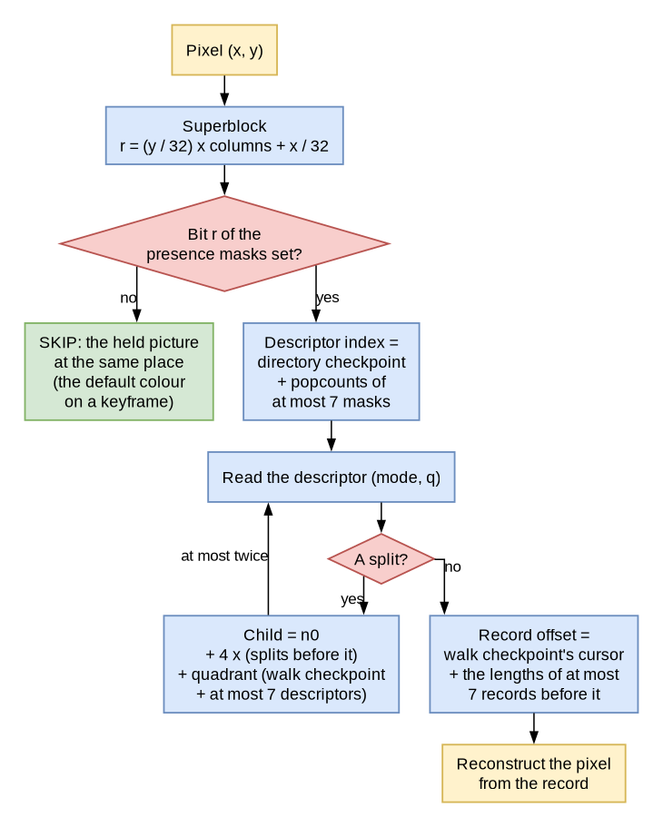
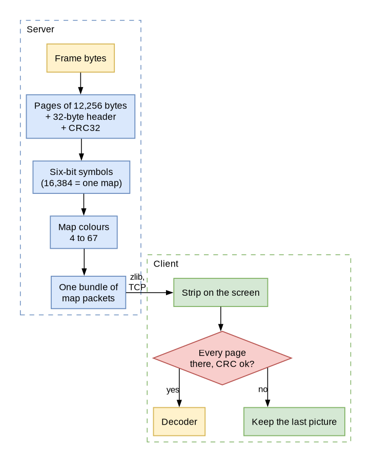
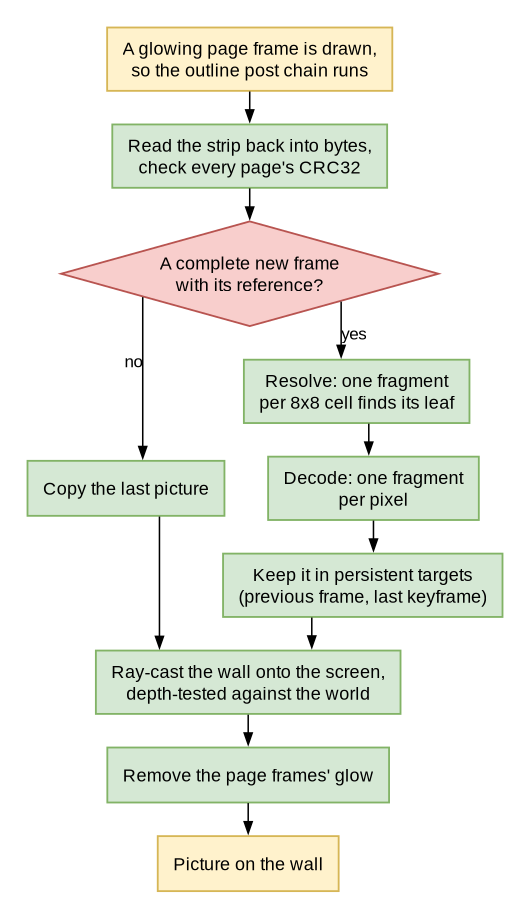
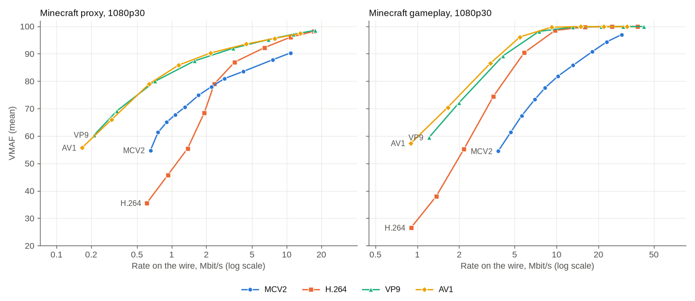

# MCV2: 1080p Video on Vanilla Minecraft Maps


*An MCV2 screen in a vanilla Minecraft 26.3 client. No mods: the picture is decoded by a resource pack's shaders.*

MCV2 is a video codec I built for one very specific screen: a wall of maps in vanilla Minecraft. The server encodes
the video, sends every frame as the colours of a few maps, and a resource pack decodes it on the player's GPU. Players
don't install anything. They accept a resource pack, and a 1920x1080 video plays on the wall in full colour for a few
megabits a second.

This post walks through why it exists, the full specification (enough to write your own decoder), how the encoder
searches, how much each feature saves, and how it stacks up against H.264, VP9 and AV1. Spoiler: the modern codecs
still win, and I'll show you by how much.

## Why Maps Need Their Own Codec

A map is 128x128 pixels, and every pixel is one byte: the id of one of the 248 map colours of Minecraft 26.3 (62 base
colours in four shades each, where the four shades of the first are transparent). MCAV has always played video by
dithering every frame down to those colours and sending them as map data. At 128 pixels per map, a 1080p picture needs
a wall of 15 x 9 = 135 maps, and one full frame is 2.2 MB of map colours.

That works for small screens. For large, moving ones it falls apart. Here is what dithered maps cost at 1080p and 30
frames a second, after Minecraft's own packet compression:

| Content | Under the plugin's default budget (128 KiB per frame and viewer) | Every change sent |
|---|---|---|
| Minecraft proxy | 10.4 Mbit/s, VMAF 33.4: the wall never shows a whole frame | 125.5 Mbit/s, VMAF 96.9 |
| Minecraft gameplay | 10.9 Mbit/s, VMAF 10.9: never a whole frame | 178.3 Mbit/s, VMAF 99.5 |

To show every frame you need over a hundred megabits a second per player, which no server can give. Under a budget the
wall lags behind the video: some maps show the current frame and some show one from seconds ago, and on gameplay the
wall turns into a mosaic of different moments. The picture is also stuck at 128 pixels per map, whatever the video's
resolution is.

MCV2 plays the same 1080p30 video like this:

| | Pre-encoded (`ship` preset) | Encoded live (`live` preset) |
|---|---|---|
| Minecraft proxy | 2.21 Mbit/s, VMAF 77.9 | 1.83 Mbit/s, VMAF 75.7 |
| Minecraft gameplay | 18.0 Mbit/s, VMAF 90.7 | 8.3 Mbit/s, VMAF 76.1 |
| Resolution | anything up to 4096 on a side | anything up to 4096 on a side |

Every rate in this post is what actually crosses the network: for MCV2 and the dithered maps, the map packets after
Minecraft's zlib; for H.264, VP9 and AV1, the encoded file. VMAF is Netflix's perceptual quality score, from 0 to 100,
higher is better.

### The Test Content

I measure everything on two clips. The **Minecraft proxy** is a procedural, Minecraft-looking 1080p clip, 30 frames at
30 fps, full of flat regions and hard block edges. It flatters MCV2, because those are exactly the things its palettes
and patterns code well, and it starves the transform codecs. The **Minecraft gameplay** clip is the honest case: 60
frames at 30 fps from Xiph's Twitch recording `MINECRAFT.y4m` (frames 120 to 239 of the 1080p60 original, every second
one), real gameplay with a lot of motion. VMAF was trained on natural video, so on the proxy it compares codecs with
each other rather than on an absolute scale.

## What a Vanilla Client Gives Us

A mod could decode video with anything, but then every player has to install it. I wanted MCV2 to work for anyone who
accepts a resource pack, so it can only use what an unmodified client does with one:

- **Map colours reach the client exactly.** The client uploads a map's bytes into a texture as they are. 64 of the
  colours can be told apart exactly after the client draws them, so a map pixel carries six bits, and a whole map 12 KB
  of data.
- **A resource pack can replace the game's shaders**, including the core text shaders that draw maps and the post
  effect that draws the outlines of glowing entities. Those run on the GPU in GLSL 330, one invocation per pixel.
- **A post effect can keep textures from one frame to the next.** That is where the previous decoded picture lives.

That's it. No compute shaders, no storage buffers, no state anywhere else, no files, no network. And the decoder is a
fragment shader, which is the constraint that shapes everything: every pixel is decoded by its own invocation, in
parallel, with no idea what its neighbours computed. So every pixel must find its own block and its own data directly
from the frame's bytes, with a bounded amount of work. There can't be a sequential scan of the frame, no entropy coder
whose state runs through the bitstream, and no prediction from neighbouring blocks.

MCV2 is the codec that fits in that box: the server encodes the video into a bitstream built so that a fragment shader
can decode any pixel on its own, sends it as the colours of a few maps per frame, and the pack's shaders decode it and
draw it over the wall.

## How a Frame Gets to the Screen


*Everything on the left runs in `mcav-bukkit` on the server; everything on the right runs in the resource pack of a
vanilla client. Nothing but map packets and one resource pack reaches the client.*

1. **Encode.** The encoder decides whether the frame is a keyframe or predicts from the previous decoded frame,
   estimates one translation for the whole frame, and then searches every 32x32, 16x16 and 8x8 block for the cheapest
   way to code it: skip it, move it, paint it with a colour, a palette or a small grid, or correct a prediction with a
   residual.
2. **Serialize.** The chosen tree is written as an index of one-byte descriptors and a payload of records, laid out so
   that the address of every record can be derived instead of stored.
3. **Transport.** The frame is cut into pages of up to 12,256 bytes, each with a 32-byte header and a CRC32. Every page
   becomes 16,384 six-bit symbols, one 128x128 map, and every symbol one of 64 map colours. All pages of a frame travel
   as one bundle of map packets, which the game's own zlib compresses.
4. **Decode.** The pack's text shaders move the page maps into a strip of the screen, and a post chain checks every
   page's CRC, finds the leaf of every 8x8 cell, reconstructs every pixel from its leaf and the reference frame, and
   keeps the result for the next frame.
5. **Show.** The same post chain ray-casts every pixel of the wall onto the screen and draws the picture over the maps,
   depth-tested against the world, so blocks and players in front of the wall hide it.

## The Bitstream

This is the full specification of an MCV2 frame. The normative definition is the Python reference decoder kept in
`tools/mcv2-reference`; MCAV's Java decoder (`mcav-bukkit`, package `me.brandonli.mcav.bukkit.media.mcv2`) is
bit-exact with it on every committed conformance frame, and so is the resource pack's shader.

**Conventions.** Integers are unsigned and little-endian unless marked signed (two's complement: s4, s8, s16). Offsets
count bytes from the first byte of the frame. Bit fields and bit streams are least significant bit first. Sizes are in
pixels, motion in half pixels.

### The Frame Header

A frame is a 48-byte header, an index and a payload of records, 48 to 16,777,215 bytes long (offsets are 24-bit). The
header is twelve 32-bit words:

| Offset | Size | Field | Contents |
|---:|---:|---|---|
| 0 | 4 | magic | `MCV2` (u32 `0x3256434D`) |
| 4 | 1 | version | 2 |
| 5 | 1 | root size | log2 of the superblock size, 5 (bytes 4-5 read u16 `0x0502`) |
| 6 | 2 | flags | the table below; bits 14 and 15 are zero |
| 8 | 2 | width | 1 to 4096 |
| 10 | 2 | height | 1 to 4096 |
| 12 | 4 | frame id | any u32; a P frame's differs from its reference id |
| 16 | 4 | reference id | the frame this one predicts from; a keyframe's is its own frame id |
| 20 | 2 | global motion x | s16 half pixels; zero on a keyframe |
| 22 | 2 | global motion y | s16 half pixels; zero on a keyframe |
| 24 | 4 | root count | exactly `ceil(width / 32) * ceil(height / 32)` |
| 28 | 4 | payload start | the end of the index and the first record byte, 48 to the total |
| 32 | 4 | total | the frame's length in bytes |
| 36 | 4 | default colour | R, G, B in bytes 36-38, byte 39 zero; nonzero only with flag 4 |
| 40 | 8 | reserved | zero |

| Flag | Name | Meaning | Needs |
|---:|---|---|---|
| 1 | `KEYFRAME` | the frame decodes without a reference | reference id = frame id, zero motion |
| 2 | `SPARSE` | the superblock index is a directory of presence masks | |
| 4 | `DEFAULT_SOLID` | a keyframe's SKIP leaves draw the default colour | a keyframe |
| 8 | `SHORT_INDEX` | stored descriptors are 3 bytes with a 16-bit offset | a frame of at most 65,535 bytes; not with 32 |
| 16 | `DERIVED_DIRECTORY` | the directory is every mask, then one checkpoint per 8 groups | 2 |
| 32 | `DERIVED_OFFSETS` | level-ordered one-byte descriptors, no stored addresses | 2 and 16 |
| 64 | `PACKED_SYMBOLS` | descriptors are indexes into a per-frame table of descriptor bytes | 32 |
| 128 | `TWO_LEVEL_WALK` | walk checkpoints are anchors plus 16-bit deltas | 32 |
| 256 | | reserved: a decoder refuses it | |
| 512 | `ENDPOINT_TABLE` | pattern endpoints are named in a per-frame table | |
| 1024 | `SELECTOR_TABLE_8` | 8-pixel pattern selector words are named in a per-frame table | its count is nonzero |
| 2048 | `SELECTOR_TABLE_16` | the same for 16-pixel patterns | its count is nonzero |
| 4096 | `SELECTOR_TABLE_32` | the same for 32-pixel patterns | its count is nonzero |
| 8192 | `ENDPOINT_565` | endpoint table entries are two RGB565 colours | 512 |

Flags 512 to 8192 belong to the derived-offsets form; a stored-index frame ignores them.

A **keyframe** may hold no temporal leaf (modes 1, 8-11, 13, 15, 17 and 20, and SKIP unless flag 4 is set). A **P
frame** predicts from the decoded picture whose frame id is its reference id; it is refused when that picture is
missing or has another size. Frame ids wrap at 2^32: a receiver commits a frame only when `0 < (id - last) mod 2^32 <
2^31`. The superblocks cover whole 32x32 blocks, so the tree also describes pixels right of and below the picture;
they are validated but never shown.

### The Block Tree

Superblocks are 32x32 blocks in raster order: superblock `i` has its top left corner at `x = (i % columns) * 32`,
`y = (i / columns) * 32`, with `columns = ceil(width / 32)`. A 1080p frame has 60 x 34 = 2,040 of them. A node is
either a **leaf** or a **split** into four children of half its size, in the order top left, top right, bottom left,
bottom right. Only 32- and 16-pixel nodes split, so every leaf is 32, 16 or 8 pixels square, and every leaf mode is
allowed at every size.

A **descriptor** is one byte, `mode | q << 5`, where `q` is a quantizer from 0 to 7. A leaf's **record** is the bytes
its mode needs. These are the leaf modes, with `s` the leaf's size; `dx` and `dy` are s8 half pixels added to the
header's global vector:

| Mode | Name | q | Record bytes | Layout | What the decoder draws |
|---:|---|---|---|---|---|
| 0 | SKIP | 0 | 0 | | P frame: the reference at the global vector. Keyframe: the default colour (flag 4) |
| 1 | MOTION | 0 | 2 | `dx`, `dy` | the reference at the global vector plus (`dx`, `dy`) |
| 2 | SOLID | 0 | 3 | R, G, B | one colour |
| 3 | PALETTE | 0 | `6 + s*s/8`: 14, 38, 134 | R0 G0 B0 R1 G1 B1, then one selector bit per pixel in raster order | the bit picks endpoint 0 or 1 |
| 4-7 | INTRA 1x1 to 8x8 | 0 | `3*g*g`, `g = 2^(mode-4)`: 3, 12, 48, 192 | `g*g` nodes, each u8 R, G, B | a bilinear RGB grid |
| 8-11 | RESIDUAL 1x1 to 8x8 | 0-7 | `2 + 3*g*g`: 5, 14, 50, 194 | `dx`, `dy`, then `g*g` nodes, each s8 Y, Co, Cg | the prediction plus the YCoCg grid times `2^q` |
| 12 | INTRA Y4C1 | 0 | 18 | 4x4 u8 luma, s8 Co, s8 Cg | a luma grid with one chroma pair |
| 13 | RESIDUAL Y4C1 | 0-7 | 20 | `dx`, `dy`, 4x4 s8 luma, s8 Co, s8 Cg | the prediction plus that residual times `2^q` |
| 14 | INTRA Y8C2 | 0 | 72 | 8x8 u8 luma, 2x2 s8 (Co, Cg) pairs | a luma grid with a 2x2 chroma grid |
| 15 | RESIDUAL Y8C2 | 0-7 | 74 | `dx`, `dy`, 8x8 s8 luma, 2x2 (Co, Cg) pairs | the prediction plus that residual times `2^q` |
| 16 | SPLIT | 0 | (a node) | | four children |
| 17 | COMPACT | 0-7 | 2 to 21 | a control byte and a body (below) | the prediction plus a compact residual |
| 18 | PATTERN | 0 | 8, 9, 11 whole; 2 to 7 with tables | below | two colours, one per column or per row |
| 19 | SPARSE SPLIT | 0 | (a node) | short stored index only | four children, some of them SKIP |
| 20 | IMMEDIATE MOTION | 0 | none | `dx`, `dy` in the descriptor; stored forms only | as MOTION |
| 21-23 | | | | reserved | refused |
| 24-31 | | | | | invalid |

Modes 0, 1, 8-11, 13, 15, 17 and 20 are **temporal**: they predict from the reference. Grid node (row, column) of a
`g x g` grid is node `row * g + column`.

### Finding a Leaf Without Stored Addresses

The question the index answers is, for any pixel: which leaf covers it, and where is that leaf's record? Every frame
the encoder writes uses the **derived-offsets form** (flags 2, 16 and 32), which stores no address at all and lets a
pixel recover each one with a bounded walk:



*At most seven mask popcounts, twice at most seven descriptors, and at most seven record lengths. No pixel needs a
neighbour's result, and nothing scans the frame from its start.*

After the header, with `G = ceil(roots / 32)` groups and `D = n0 + n1 + n2` descriptors, the index is:

| Region | Bytes | Contents |
|---|---|---|
| presence masks | `4 * G` | a u32 per group of 32 superblocks; bit `b` of group `g` marks superblock `32g + b` present, bits past the last superblock are zero |
| directory checkpoints | `4 * ceil(G / 8)` | a u32 for each group `8k`: the number of present superblocks before it |
| level counts | 6 | u16 `n0`, `n1`, `n2`: the descriptors of 32-, 16- and 8-pixel nodes |
| symbol table (flag 64) | `1 + S` | u8 `S`, 1 to 32, then `S` descriptor bytes in strictly increasing order |
| descriptor plane | `D`, or `ceil(D * w / 8)` with flag 64 | the descriptors in level order |
| walk region | `4 * W`, or the two-level form | `W = ceil(D / 8)` checkpoints |
| endpoint count (flag 512) | 1 | u8 `P`, at least 1 |
| selector counts (flag 1024, 2048 or 4096) | 3 | u8 `c8`, `c16`, `c32` |
| payload | | the leaf records in level order |
| selector words | `2*c8 + 3*c16 + 5*c32` | the 8-pixel words, then the 16-, then the 32-pixel words |
| endpoint pairs | `6 * P`, or `4 * P` with flag 8192 | the last bytes of the frame |

The index ends exactly at the payload start, and the records end exactly where the selector words begin.

**Presence.** A superblock whose bit is clear is a 32-pixel SKIP leaf with no descriptor (a keyframe allows that only
with flag 4). A superblock's position among the descriptors is its group's checkpoint, plus the popcounts of at most
seven masks between that checkpoint's group and its own, plus the popcount of its own mask below its bit.

**Level order.** Level 0 is the present superblocks in raster order (`n0` descriptors). Level 1 is the four children of
every level-0 split, split by split (`n1 = 4 * splits in level 0`), and level 2 likewise from level 1 (`n2`); level 2
holds no split. Counting splits replaces child pointers: the first child of the split at index `i` is descriptor
`n0 + 4 * (splits before i)`. Here leaf modes are 0-15, 17 and 18, and a split's q is zero.

**Packed symbols** (flag 64). A frame uses few distinct descriptor bytes, so the plane holds `w`-bit indexes into the
symbol table, `w = max(1, bit_length(S - 1))`. Index `i` starts at plane bit `i * w`: read the u16 at
`plane + (i * w >> 3)` (it may reach into the walk region), shift it right by `i * w & 7` and keep `w` bits. An index of
`S` or more is invalid.

**Records.** Leaf `i`'s record starts at the payload start plus the lengths of the records of the leaves before it in
level order; splits have none. A length follows from the mode, the size and the flags, and for COMPACT from the
record's own control byte, so no earlier record has to be parsed to find it.

**Walk checkpoints.** Checkpoint `k` holds the pair (cursor, splits) before descriptor `8k`: the payload bytes and the
splits among descriptors `0` to `8k - 1`, both u16. From it, a reader finds any descriptor's record and children by
walking at most seven descriptors. Without flag 128 the region is `W` pairs of u16. With the **two-level walk** (flag
128) it is u8 `cursorBits` and u8 `splitsBits` (each 1 to 16, their sum at most 16, and the smallest widths that hold
the frame's deltas), then an absolute u16 pair for every fourth checkpoint (`k` = 0, 4, 8, ...), the anchors, then a
u16 for every other checkpoint in order: `(cursor - anchor cursor) | (splits - anchor splits) << cursorBits`, measured
from anchor `k - k % 4`, with zero bits above `cursorBits + splitsBits`. That is `2 + 4A + 2(W - A)` bytes with
`A = ceil(W / 4)`.

**Tables.** Endpoint pairs start at `total - P * entry`, and the selector words sit just before them. Endpoint pairs are
distinct after expansion. A selector word is `1 + size / 8` bytes (2, 3 or 5), the words of one size are distinct, and
a size's count is nonzero exactly when its flag is set.

### The Stored Index Forms

Frames that don't set flag 32 store every address instead. They are simpler, cost more bytes, and the encoder only
falls back to them for frames with more than 65,535 descriptors or payload bytes, beyond the reach of the u16 counts.

- **Descriptors.** Wide: a u32 with the offset in bits 0-23, the mode in bits 24-28 and q in bits 29-31. Short (flag
  8): a u16 offset, then the byte `mode | q << 5`. The offset is absolute: a leaf's record, a split's child table, zero
  for SKIP (whose whole word is zero), and for mode 20 the motion itself (s8 `dx` in bits 0-7, s8 `dy` in bits 8-15).
- **Superblock index.** Dense (flag 2 clear): superblock `i`'s descriptor at `48 + i * stride`, stride 4 or 3. Sparse
  (flag 2): presence masks as above; without flag 16, one (u32 mask, u32 pointer) pair per group, with it every mask and
  then one u32 checkpoint per group `8k`, each the absolute offset of the group's first descriptor. The present
  descriptors of all groups follow the directory back to back.
- **Node table.** It follows the superblock descriptors. Walking the superblocks in raster order and each tree depth
  first, every split's child table sits at the current position. Mode 16 has four descriptors (zero for a SKIP child).
  Mode 19, short index only, has a mask byte below 15 (bit `i` marks child `i` present), then one nonzero descriptor per
  present child; absent children are SKIP.
- **Payload.** Records follow in the order the walk meets the leaves, without gaps, and the last ends at the frame's
  end. Pattern records are stored whole.

### Leaf Records

**COMPACT (mode 17).** The control byte holds the class in bits 0-3 and the motion form in bits 4-7. Form 0 adds no
bytes and uses the global vector alone; form 1 adds one byte, s4 `dx` in bits 0-3 and s4 `dy` in bits 4-7; form 2 adds
s8 `dx` and s8 `dy`. The body follows, s8 bytes unless noted:

| Class | Name | Body | Fields | Y, Co, Cg |
|---:|---|---:|---|---|
| 0 | DC_Y | 1 | dc | Y = dc, Co = Cg = 0 |
| 1 | GRID2_YC | 6 | 2x2 luma nodes, Co, Cg | Y from the 2x2 grid |
| 2 | GRID4_N4_YC | 10 | 16 s4 luma nodes in 8 bytes (node `2i` in the low nibble of byte `i`, `2i + 1` in the high), Co, Cg | Y from the 4x4 grid |
| 3 | GRID4_N4_Y | 8 | 16 s4 luma nodes as in class 2 | Y from the 4x4 grid, Co = Cg = 0 |
| 4 | GRID4_YC | 18 | 4x4 luma nodes, Co, Cg | Y from the 4x4 grid |
| 5 | VQ64 | 4 | dc, Co, Cg, u8 index below 64 | Y from the 4x4 grid `VQ[index] + dc` |
| 6 | PQ64 | 5 | dc, Co, Cg, u16 `ids` below 4096 | Y from the 4x4 grid whose columns 0-1 are `PQ0[ids & 63]` and 2-3 `PQ1[ids >> 6]`, plus dc |
| 7 | GAIN_BIAS | 4 | g, then a Y, Co, Cg bias | each channel is `P * (1 + g/64)` plus the bias converted to RGB, unscaled |
| 8 | LOW2 | 5 | dc, sx, sy, Co, Cg | `Y = dc + sx * a(x) + sy * a(y)`, `a(i) = ((i + 0.5) / s) * 2 - 1` |

Every class but 7 draws the prediction plus the RGB of `(Y * 2^q, Co * 2^q, Cg * 2^q)`, with Co and Cg flat over the
block. A class above 8, a form above 2, class 7 with a nonzero q, and a PQ record whose last byte has a nonzero high
nibble are invalid. The **residual books** are 2,048 s8 bytes (SHA-256
`1737842f5fbaa3e23777a04b6869a2bbd7d088c40efd1a8d237d756458c3e788`, in the decoder's resources): bytes 0-1023 are the
64 VQ vectors of 16 nodes (4x4, row-major), bytes 1024-2047 are PQ book 0 and then PQ book 1, each 64 vectors of 8 nodes
(4 rows of 2, row-major).

**PATTERN (mode 18).** A pattern is a two-colour palette whose selectors repeat along one axis. Its record is the
endpoints, six bytes R0 G0 B0 R1 G1 B1 or with flag 512 a u8 index into the endpoint table; then the selector word, an
orientation byte (0: the selector follows x, 1: it follows y) and `s / 8` axis bytes whose bit `i` is the selector of
column or row `i`, or with this size's selector flag a u8 index into that size's table. Pixel `(x, y)` takes endpoint
`axis[orientation == 0 ? x : y]`. So a record is 8, 9 or 11 bytes whole, 3, 4 or 6 with an endpoint index, 7 with a
selector index and 2 with both. Endpoint table entries are six bytes, or with flag 8192 two u16 RGB565 colours (R in
bits 11-15, G in 5-10, B in 0-4) expanded as `r << 3 | r >> 2`, `g << 2 | g >> 4`, `b << 3 | b >> 2`.

### Reconstruction

Every leaf is reconstructed on its own into a whole `s * s` block, and the part inside the picture is kept. Bit-exact
decoding comes down to these rules:

- **Prediction.** Pixel `(X, Y)` with vector `(mx, my)` samples the reference at the half-pixel position
  `hx = clamp(2X + mx, 0, 2 * (width - 1))`, `x0 = hx >> 1`, `x1 = min(x0 + 1, width - 1)`, and the same in y,
  averaging one, two or four pixels as `hx` and `hy` are even or odd.
- **Grids.** Along an axis of `g` nodes over `s` pixels, `t = clamp((p + 0.5) * g / s - 0.5, 0, g - 1)`,
  `i0 = floor(t)`, `i1 = min(i0 + 1, g - 1)`, `f = t - i0`, and the value is bilinear in the four nodes around the
  pixel. The weights are dyadic and the nodes are integers times powers of two, so every value is exact.
- **Colour.** YCoCg converts as `R = (Y + Co) - Cg`, `G = Y + Cg`, `B = (Y - Co) - Cg`, associated left to right, and a
  residual is converted first and then added to the prediction.
- **Rounding.** Every channel ends as `floor(clamp(v, 0, 255) + 0.5)`, so SKIP and motion leaves round half-pixel
  averages half up.
- **Precision.** The reference computes in float32, except modes 13 and 15, which scale, convert and add the
  prediction in float64 and narrow to float32 once before rounding. Every number involved is a dyadic rational with few
  significant bits, so an implementation in exact integer arithmetic (as MCAV's decoder and encoder are) produces the
  same bytes. Modes 8-11 scale the nodes by `2^q` before interpolating; mode 17 applies `2^q` after interpolating.
- **Nibble classes.** Read the bytes of compact classes 2 and 3 unsigned before splitting the nibbles.

### Validation and Limits

Every field is hostile until it is checked. A decoder reads only inside the frame, checks every count, offset and
length before using it, and allocates in proportion to the input:

| Bound | Limit |
|---|---|
| frame length | 48 to 16,777,215 bytes |
| width, height | 1 to 4096, so at most 16,384 superblocks in 512 groups |
| short-index frame | at most 65,535 bytes |
| depth | splits at 32 and 16 pixels only |
| q | 0-7; nonzero only in modes 8-11, 13, 15 and 17, zero in compact class 7 |
| level counts, walk checkpoints | u16 |
| symbol table | 1 to 32 increasing entries |
| walk delta widths | 1 to 16 each, their sum at most 16, minimal |
| endpoint table | 1 to 255 distinct pairs |
| selector tables | 0 to 255 distinct words per size, nonzero exactly when flagged |
| compact record | class 0-8, form 0-2, VQ index below 64, PQ ids below 4096 |
| pattern record | orientation 0 or 1, indexes inside their tables |

A decoder must also accept a few layouts the encoder never writes: a present superblock whose derived descriptor is
SKIP, table entries no leaf names, nonzero bits after the last packed descriptor, and flags 512 to 8192 on a
stored-index frame. Frames with the magic `MCV1` are the first version of the format and are not covered here.

## Pages on Maps



*A frame is cut into pages, every page becomes a map, and the client only decodes a frame whose pages all arrived
intact.*

A frame travels as **pages**. A page is a 32-byte header followed by a slice of the frame:

| Offset | Size | Field | Rule |
|---:|---:|---|---|
| 0 | 4 | magic | `MCP1` |
| 4 | 1 | version | 1 |
| 5 | 1 | symbol bits | 6 (7 and 8 are defined; maps use 6) |
| 6 | 2 | frame type | 1 for a keyframe, 0 for a P frame |
| 8 | 4 | stream id | chosen by the sender; a receiver only takes its own |
| 12 | 4 | frame id | the frame's |
| 16 | 2 | page number | below the page count |
| 18 | 2 | page count | `ceil(frame length / capacity)` |
| 20 | 4 | reference id | the frame's |
| 24 | 4 | frame length | 48 to 16,777,215 |
| 28 | 4 | CRC32 | IEEE CRC-32 (as zlib computes it) of the header with this field zero, then the page's slice |

A page holds `16384 * bits / 8 - 32` frame bytes, 12,256 at six bits, and page `n` carries the frame bytes from
`n * capacity` on. The CRC detects damage; it is not authentication.

**Symbols.** A page's bytes are read least significant bit first into one bit stream and cut into six-bit symbols,
least significant bit first, the last one zero-filled. A page of `n` frame bytes is `ceil((32 + n) * 8 / 6)` symbols,
so a full page is exactly 16,384: one 128x128 map. The header ends inside a symbol, so a receiver decodes it from the
first 43 symbols, checks it, and then requires the exact symbol count, every symbol below 64, zero padding bits and a
matching CRC.

**Map colours.** Symbol `s` is sent as the map colour `s + 4`: the colour ids 4 to 67, the four shades of base colours
1 to 16, whose 64 RGB values are all different, so the client's texture tells them apart exactly. A shorter last page
is padded to whole 128-colour rows with colour 4. Six bits per map byte is the price of using maps: the 244 opaque
colours would hold almost eight bits, but a symbol must be recovered from the RGB the client draws, so the alphabet is
a power of two of distinct colours.

**Packets.** The server writes page `n` of a frame into the top rows of page map `pageMap + n`, one map-data packet per
page, and sends all pages of a frame in one bundle so they arrive together. Minecraft compresses every packet that
reaches the server's compression threshold, 256 bytes by default, with zlib, and map colours that carry six-bit symbols
use only 64 of 256 byte values, so compression takes back a good part of the six-bit expansion. That compression costs
the server 1.3 to 2.0 % of a core per viewer, and the client 55 to 76 microseconds per frame to inflate, so I leave it
on.

**Reassembly.** Pages of one stream may arrive in any order. At most four frames are pending, and a page of a fifth
evicts the oldest. A page must agree with the pages already held for its frame in page count, reference id, frame length
and frame type, and a repeated page number must repeat the page exactly; anything else drops the whole frame. When every
page is there, the slices are joined in page order, the frame is parsed, and its ids and keyframe flag must match the
pages.

**One stream, many viewers.** A screen is encoded once, and every viewer gets it through a link of their own, which
sends a frame only when that viewer can decode it (a keyframe, or a P frame whose reference that viewer was sent) and
only while the video already handed to the viewer's connection but not yet written is at most 128 KiB (twice that for a
keyframe), with the default settings. The check comes before the frame is added, so one frame can take the backlog
above it. A viewer whose connection falls behind skips to the next frame they can decode and the others are not held
back; what is already in flight can't be taken back, so a connection slower than the stream can still delay that
viewer's game packets.

## Decoding in the Shader



*The post chain runs on every rendered frame while a page frame is in view. A frame that is incomplete, damaged or
missing its reference is never decoded: the client keeps the last picture.*

**The hook.** The game runs the post effect `post_effect/entity_outline.json` after the main pass whenever a glowing
entity was drawn, and a post effect can declare render targets `"persistent": true`, which survive from one frame to
the next until a resource reload. That's the whole foundation: the first gives the decoder a place to run on every
frame, the second a place to keep the previous picture. So every MCV2 screen hides **page frames** two blocks behind
its wall: invisible item frames holding the page maps, glowing on a team of their own, shown only to players who
loaded the pack. The last pass removes their outline colour, so nobody ever sees the glow.

**The strip.** The pack's `core/text.vsh` sees every map the client draws. A page map, recognised by its `MCP1`
header, has its quad moved to an exact strip of rows at the top of the screen, one slot per page, and `core/text.fsh`
writes its symbols through unchanged, four symbols into the three bytes of one pixel. Every other map, sign and piece
of text is drawn exactly as vanilla draws it.

**The anchors.** The screen's own maps carry small anchor patches in their top rows: a signature, the frame's column
and row, the wall's size and facing, and a checksum. The vertex shader of any visible anchor writes the wall's corner,
its right and down vectors and the projection into the screen's descriptor row. That's how the post chain learns where
the wall is, without a marker colour that anything in the world could imitate.

**The passes.** The chain reads the strip back into bytes, recomputes every page's CRC32 in 192-byte chunks (one
fragment per chunk), checks every header, and decides whether this rendered frame brings a complete new frame. If it
does, a **resolve** pass runs one fragment per 8x8 cell to find the cell's leaf with the walk above (leaves are at
least 8x8 and aligned, so all 64 pixels of a cell share the answer), and a **decode** pass runs one fragment per pixel:
on a P frame, SKIP and MOTION take a short path straight to the reference; every other leaf reads only its own record
and the tables it names. The result is copied into a persistent target, and on a keyframe into a second one. Then the
chain ray-casts every pixel of the wall's screen box onto the wall's plane, depth-tests it against the scene, and draws
the picture. No step loops over other pixels, and every loop has a constant bound, so a malformed frame can't make a
fragment do unbounded work or read outside its textures.

**References.** The pack keeps two persistent references, the previous decoded frame and the last decoded keyframe, and
a P frame's reference id picks which one it predicts from. By default every P frame predicts from the frame before it:
that is the cheapest on the wire, but a client that misses a frame (it renders fewer frames than the video has, looks
away, or reloads its resources) can't decode the frames after it, and keeps the last picture until the next keyframe: at
most 2 seconds for `ship` and 4 seconds for `live` at 30 fps. Predicting from the last keyframe instead lets any render
rate work, but costs rate on the wire: 65% more on the proxy and 14% more on the gameplay clip, measured the way the
features [below](#how-much-each-feature-saves) are.

**The resource pack.** The server builds it and serves it for pack format 97 (Minecraft 26.3). Its shader sources are
fixed; what depends on the server is generated into it: the video sizes, page slots and stream ids of the screens, the
page frames' outline colour, the transport alphabet (the RGB of map colours 4 to 67, from the server's own colour
table) and the residual books. One pack decodes every MCV2 screen of the server, up to eight at once, each in a slot of
its own video size, so screens of sizes the pack already has start and stop without anyone reloading. It is optional
and additive: offered with `required: false`, and a player who declines keeps the dithered maps of the same wall.
Minecraft 26.3 compiles every shader through SPIR-V and back into GLSL 330, and the pack is written for that path; it
replaces vanilla's `core/text.vsh`, `core/text.fsh` and `post_effect/entity_outline.json` with copies that are
vanilla's plus the decoder.

## The Encoder

The format doesn't fix how a frame is searched: any stream that follows the specification decodes the same way
everywhere. MCAV has two searches. The **reference search** of the `ship` and `low_bandwidth` presets measures every
candidate, and the **live searches** (`live`, `adaptive`, `live-fast`) are cheaper ones for sources that play while
they are encoded. Here's the reference search, one frame at a time:

1. **Keyframe or P frame.** A frame is a keyframe when there is no previous decoded frame of the same size, when the
   key interval has passed (60 frames for the pre-encoded presets, 120 for the live ones), or at a scene cut: when the
   mean absolute luma difference between the source and the previous decoded frame, moved by the global vector, is
   above 45. Every other frame is a P frame and predicts from the previous decoded frame.
2. **One translation for the whole frame.** Both pictures' luma, averaged down to a quarter of the resolution, go
   through phase correlation: a 2D FFT of each, the cross-power spectrum normalised to unit magnitude, and its inverse
   transform peaks at the shift between them. That coarse vector is refined at full resolution over a 7x7 window of
   whole pixels, and stored in the header in half pixels. SKIP leaves copy the reference at this vector, and every
   other temporal leaf stores its motion relative to it, which is why a camera pan costs almost nothing.
3. **Trials.** The frame is searched once per trial and the trial whose bytes cost least is kept: the global vector,
   and the zero vector as well when the global vector isn't zero, each once with full RGB pattern endpoints and once
   with RGB565 ones. The trials share most of the work.
4. **Every block, every candidate.** Every 32x32 superblock, its four 16x16 blocks and their sixteen 8x8 blocks are
   searched on their own, so all blocks run in parallel and the stream is the same on any number of threads. For each
   block the candidates are SKIP at each trial vector; local motion, a diamond search around the global vector from 24
   pixels down to half a pixel, which gives a MOTION leaf and the prediction every residual builds on; SOLID and
   PALETTE; bilinear grids of 2x2, 4x4 and 8x8 nodes as INTRA, and on P frames grids of 1x1 to 8x8 as RESIDUAL in YCoCg
   with a quantizer of 0 to 3; the two reduced-chroma grids, also as residuals; PATTERN; and COMPACT residuals in six
   classes at the global and at the local vector. A grid is fitted with the pseudo-inverse of the decoder's own bilinear
   interpolation, so the fit minimises the error of what the decoder draws.
5. **The cost.** Every candidate is reconstructed exactly as the decoder will reconstruct it and scored as
   `D + lambda * (8 * record bytes + 10.5)`, where `D` is the squared error in YCoCg weighted 4:1:1 for luma and the
   10.5 bits are a leaf's share of the descriptors and walk checkpoints. Lambda is the price of a bit: higher lambda,
   fewer bits and a worse picture. The first strictly cheapest candidate wins.
6. **The tree, bottom up.** Four 8x8 leaves replace their 16x16 block when their costs plus a split's 10.5 bits are
   strictly lower than the 16x16 block's best leaf, and then the same for the 16x16 choices against the 32x32 leaf.
   Every palette whose selectors repeat along one axis is then rewritten as a pattern.
7. **Writing.** The writer uses the derived-offsets form with a symbol table when the frame has at most 32 distinct
   descriptor bytes, the two-level walk when it is smaller, an endpoint table when pattern endpoint pairs repeat enough
   to pay for it, and a selector table per block size on the same terms. On a keyframe, the commonest solid colour
   becomes the header's default colour, and its SOLID leaves become free SKIP leaves.
8. **The closed loop.** Each trial's bytes are decoded and priced as a whole, and the cheapest is kept. The decoded
   picture, not the source, becomes the reference for the next frame, so the encoder predicts from exactly what every
   client holds and errors never pile up between the two.

The reference search takes 570 ms per 1080p frame on 12 threads of an i7-8700, so it is for files encoded ahead of
time. The **live searches** write the same format from a cheaper search: one trial, with the vector chosen before the
search by what SKIP would cost; SKIP decided early where nothing else can win; splits decided from the top; fewer
candidates (the modes the reference search actually picks on gameplay); motion searched at half and quarter resolution
first; a lambda that rises with motion, since VMAF forgives more error in motion; and the pixel kernels in a small
SIMD library per platform that computes exactly what the Java kernels compute, so a stream is byte-identical whichever
kernels encoded it.

## How Much Each Feature Saves

To see what each part of the format buys, I turned one feature off at a time in the reference search, encoded both
clips at six lambdas, and measured the BD-rate on the wire against the full encoder: the average extra rate the
encoder needs for the same VMAF, over the VMAF range both curves cover.


*Each bar is the BD-rate of the encoder with that one feature turned off, against the full encoder, on the rate after
Minecraft's zlib.*

| Feature turned off | Minecraft proxy | Minecraft gameplay |
|---|---:|---:|
| 16x16 and 8x8 leaves | +203.4% (VMAF 55-74) | +36.7% (VMAF 54-77) |
| Prediction from the previous frame | +89.8% (55-86) | +56.5% (54-95) |
| Derived offsets | +35.2% (55-88) | +20.0% (54-97) |
| Local motion | +28.2% (55-87) | +9.0% (56-97) |
| Compact residuals | +10.2% (55-86) | +24.3% (54-95) |
| Patterns | +28.9% (55-88) | +2.9% (54-97) |
| Palettes | +4.4% (55-87) | +25.0% (54-97) |
| Endpoint and selector tables | +9.2% (55-88) | +1.4% (54-97) |
| Two-level walk | +4.5% (55-88) | +2.0% (55-97) |
| Packed symbols | +2.8% (55-88) | +1.8% (55-97) |
| Reduced-chroma grids | +1.1% (55-88) | +1.8% (55-96) |
| Half-pixel motion | +0.7% (55-88) | +0.3% (55-97) |
| Residual grids | +0.3% (55-88) | -0.1% (55-97) |
| Global motion | 0.0% (55-88) | +0.1% (55-97) |
| Intra grids | -1.0% (58-88) | 0.0% (54-97) |

A positive number is what the feature saves: without it, the encoder needs that much more rate for the same VMAF. The
range in brackets is the VMAF range the two curves share.

The leaf sizes matter most. With every superblock one 32x32 leaf, the proxy needs three times the rate, and neither
clip gets above a VMAF of about 77 at any lambda, so that row compares a narrower range than the others. Prediction
from the previous frame comes next: without it, every frame is a keyframe. The derived-offsets row also turns off
everything that only exists in that form (the packed symbols, the two-level walk and both kinds of table), so it is
the whole addressing scheme against the stored-index form; the rows for those pieces turn them off one at a time.

The two clips lean on different tools. On the proxy's flat regions and hard edges, patterns and local motion carry the
most; on the gameplay clip, palettes and compact residuals do. That's why the reference search tries every candidate
on every block instead of guessing from the content.

Half-pixel motion, global motion and the residual and intra grids come out within about a percent of zero on both
clips, so these two clips can't put a number on them. Global motion only pays off when the whole picture moves as one
piece, like a pan across a flat scene.

## MCV2 Against H.264, VP9 and AV1

Here is MCV2 on the same two clips as H.264 (x264 `veryslow`), VP9 (libvpx, `good`, `cpu-used 0`) and AV1 (libaom,
`cpu-used 6`). Every encode goes from raw RGB into its codec, is decoded back to raw RGB, and is scored against the
source with the same VMAF filter, so each curve includes its codec's chroma subsampling. MCV2's rate is its map packets
after Minecraft's zlib, the bytes a player actually downloads; the others are their encoded file, without any
transport at all.



*Rate against VMAF on the two clips, 1080p at 30 fps. MCV2 is the reference search at eleven lambdas on the proxy and
ten on gameplay.*

The rate each codec needs for the same VMAF:

| VMAF | MCV2 | H.264 | VP9 | AV1 |
|---:|---:|---:|---:|---:|
| **Minecraft proxy** | | | | |
| 70 | 1.26 | 1.98 | 0.35 | 0.38 |
| 75 | 1.73 | 2.18 | 0.51 | 0.51 |
| 80 | 2.65 | 2.47 | 0.72 | 0.70 |
| 85 | 5.12 | 3.19 | 1.22 | 1.07 |
| 90 | 10.30 | 4.97 | 2.44 | 2.09 |
| **Minecraft gameplay** | | | | |
| 70 | 6.18 | 3.14 | 1.83 | 1.62 |
| 75 | 7.46 | 3.58 | 2.25 | 2.02 |
| 80 | 9.33 | 4.20 | 2.79 | 2.51 |
| 85 | 12.49 | 4.93 | 3.44 | 3.13 |
| 90 | 17.18 | 5.78 | 4.34 | 3.99 |

*Mbit/s, interpolated log-linearly between the measured points.*

So, honestly:

- **On the proxy**, MCV2 beats x264 at `veryslow` below about VMAF 78 (1.73 against 2.18 Mbit/s at VMAF 75), ties it
  around 80, and loses above that. Averaged over the whole range, MCV2 needs 15.8 % less rate than H.264, but VP9 and
  AV1 need about a quarter of what MCV2 needs (BD-rate +273 % and +277 % for MCV2).
- **On real gameplay**, MCV2 loses clearly: it needs 2.1 times H.264's rate at VMAF 75, 3.3 times VP9's and 3.7 times
  AV1's (BD-rate +134 %, +271 % and +309 %).

I didn't measure HEVC, so it isn't on the chart.

Why does it lose by that much? AV1 wins with three tools MCV2 can't have: a transform that turns a block of residual
into a few frequency coefficients, entropy coding that spends fewer bits on frequent symbols, and prediction from the
pixels of neighbouring blocks. All three need sequential state: the entropy decoder's state runs through the
bitstream, and a block's prediction needs its neighbours decoded first. A fragment shader that decodes every pixel on
its own can't do either. On top of that, every byte rides in six-bit symbols. What MCV2 has instead are tools that are
cheap to look up per pixel: palettes and patterns that code a hard block edge exactly in a few bytes, bilinear grids
for smooth gradients, motion relative to one global vector, and an index whose addresses are derived instead of stored.
On flat, hard-edged content that is competitive with H.264; on real video it isn't.

The upside is the one thing none of the others can do: it plays on a vanilla Minecraft client.

## What It Costs

**The player's GPU.** I measured the pack's post chain pass by pass on an Intel UHD 630, a 2018 desktop integrated
GPU, with a 6x3 screen covering 57 % of the view. Per rendered 1080p frame:

| Rendered frame | `ship` stream | `live` stream |
|---|---:|---:|
| brings a new P frame | 7.9 ms | 7.4 ms (quiet content), 8.7 ms (gameplay) |
| brings a new keyframe | 8.8 ms | |
| brings no new video | 6.6 ms | 5.7 to 5.9 ms |

The chain runs on every rendered frame while a page frame is in view; the decode itself runs once per video frame,
and a copy stands in on the others. A UHD 630 is the only GPU I measured.

**Live encoding.** On a 6-core i7-8700 (12 threads) with the native AVX2 kernels, every frame verified, the 95th
percentile time to encode a 1080p frame:

| Preset | 12 threads: proxy | 12 threads: gameplay | 6 threads: proxy | 6 threads: gameplay |
|---|---:|---:|---:|---:|
| `live` (the default) | 20.1 ms | 31.2 ms | 22.6 ms | 36.4 ms |
| `adaptive` | 20.4 ms | 27.4 ms | 22.5 ms | 31.6 ms |
| `live-fast` | 17.6 ms | 27.2 ms | 20.9 ms | 31.8 ms |

A 30 fps frame has 33 ms, so 1080p30 is met on 12 threads. With the default budget of 6 threads, `live` on gameplay
misses it at the 95th percentile while its mean, 29 ms, still fits: a late frame now and then. 1080p60 isn't met: even
`live-fast` finishes a frame every 19.7 ms on the proxy and 31.3 ms on gameplay at the 95th percentile, against the 16.7
ms a 60 fps frame has. These are times on a quiet machine. On the same machine busy with other work (a load average of
54 on its 12 threads), `live` took 73 ms per gameplay frame at the 95th percentile on 6 threads, so measure your own
server rather than take them as a promise. Compared with `ship` at equal VMAF on the wire, `live` costs -3.4 % on the
proxy and +6.9 % on gameplay, `adaptive` -3.8 % and +14.3 %, and `live-fast` +18.4 % and +17.1 %. Pre-encoding a
minute of 1080p30 with `ship` takes 26 minutes on four threads.

**The server.** Every MCV2 screen shares one encoder budget, half the processors by default, and the encoders never
run on the server thread: with one or two live 1080p screens the server kept 20 TPS, and the tick's 95th percentile
went from 0.53-0.72 ms to 0.78-0.91 ms. A live 1080p encoder keeps about 49 MB of heap (20 MB at 720p). When the
encoder can't keep up, the screen steps down by itself: a faster preset, fewer frames a second, a smaller video, and
at worst the dithered maps.

**Each viewer's connection** (1080p30, after zlib):

| Preset and content | Rate |
|---|---:|
| `live`, quiet content | 1.83 Mbit/s |
| `live`, fast gameplay | 8.3 Mbit/s |
| `adaptive`, fast gameplay | 8.6 Mbit/s |
| `ship`, pre-encoded, quiet content | 2.21 Mbit/s |

## Turning It On

With the MCAV plugin, add `--codec mcv2` to any command that draws on a wall of maps, or set
`mcv2.default-codec: mcv2` in `plugins/MCAV/config.yml`:

```text
/mcav video map @a FFMPEG NONE 1920x1080 15x9 0 NEAREST_COLOR "" https://www.youtube.com/watch?v=... --codec mcv2
```

Players are asked to load the pack; those who decline keep seeing the dithered maps of the same wall. Presets,
configuration, hosting the pack, the client mod for Iris shader players and the Java API are on the
[MCV2 on Maps](bukkit/mcv2.md) page.

## Limits

- **Lighting.** The picture is drawn at full brightness, like a map in a glow item frame: the post chain has no light
  level for the wall.
- **Shader packs.** Iris with a shader pack on replaces the pack's shaders, so on its own the wall shows no MCV2
  picture. With Iris 1.11.7 the MCV2 client mod decodes it anyway: it builds the transport strip on the CPU from the
  frame's maps after the shader pack's final image and runs the pack's chain over it. With another Iris version the mod
  tells the server, which shows that player the dithered maps. Sodium, and Iris with its shaders off, show MCV2
  normally. Improved transparency shows no MCV2 picture.
- **Tested clients.** Every client I tested ran on Linux and drew in software (Mesa's llvmpipe). NVIDIA, AMD and Apple
  GPUs, Windows and macOS clients, and the Vulkan backend were never tested.
- **The top of the screen.** While a page frame is in view, the strip takes the top rows of the screen (41 rows in an
  854x480 window with one screen of eight slots, 25 at 1080p), and the chain covers them with the scene row just below,
  so a detailed sky or ceiling smears there.
- **Missed frames.** A client that renders fewer frames than the video has misses frames, and under the default
  prediction a missed frame is repaired only by the next keyframe.
- **Sound.** The audio web page keeps a tenth of a second of sound buffered, so its sound comes 0.1 to 0.15 s after
  the wall shows the same moment, with MCV2 as with the dithered maps (measured with a client drawing in software and a
  browser playing into a virtual sound device; a client drawing on a GPU shows the picture sooner). The plugin
  doesn't delay the picture to match.

## Sources

- [Map](https://minecraft.wiki/w/Map), [Map item format](https://minecraft.wiki/w/Map_item_format),
  [Shader](https://minecraft.wiki/w/Shader) and [Pack format](https://minecraft.wiki/w/Pack_format), Minecraft Wiki
- [AV1 Bitstream & Decoding Process Specification](https://aomediacodec.github.io/av1-spec/)
- [Toward A Practical Perceptual Video Quality Metric](https://netflixtechblog.com/toward-a-practical-perceptual-video-quality-metric-653f208b9652),
  the VMAF post from Netflix
- G. Bjontegaard, Calculation of Average PSNR Differences between RD-curves, VCEG-M33, 2001
- C. D. Kuglin and D. C. Hines, The Phase Correlation Image Alignment Method, 1975
- S. Zhu and K.-K. Ma, A New Diamond Search Algorithm for Fast Block-Matching Motion Estimation, 2000
- H. Malvar and G. Sullivan, YCoCg-R: A Color Space with RGB Reversibility and Low Dynamic Range, 2003
- [ZLIB Compressed Data Format Specification](https://www.rfc-editor.org/rfc/rfc1950), RFC 1950
- [Xiph.org Video Test Media](https://media.xiph.org/video/derf/), the source of the gameplay clip

The measurements behind every chart are in `tools/mcv2/data`, and `tools/mcv2/figures` draws the pictures again.
