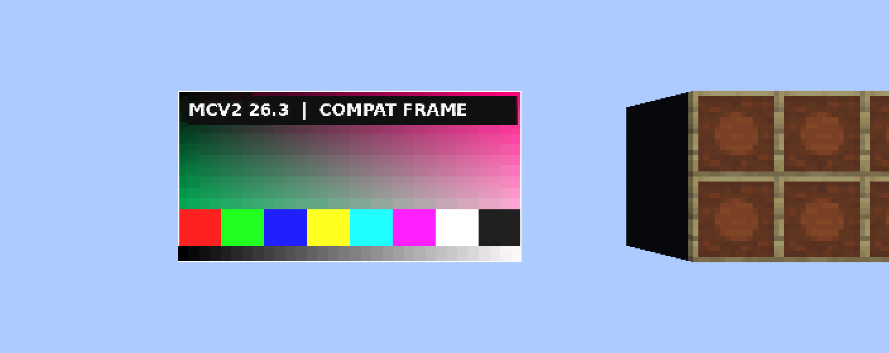
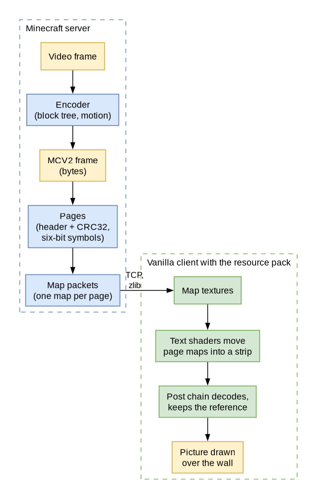
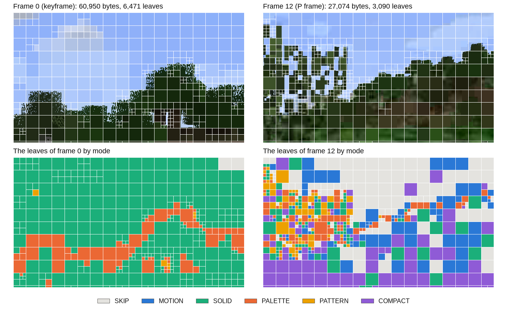
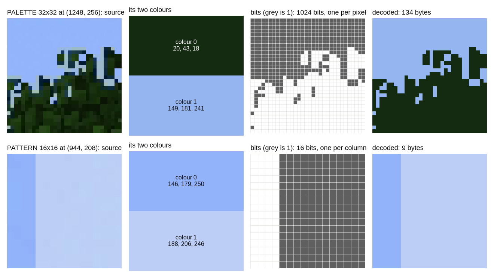
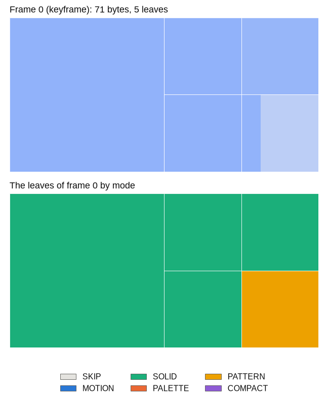
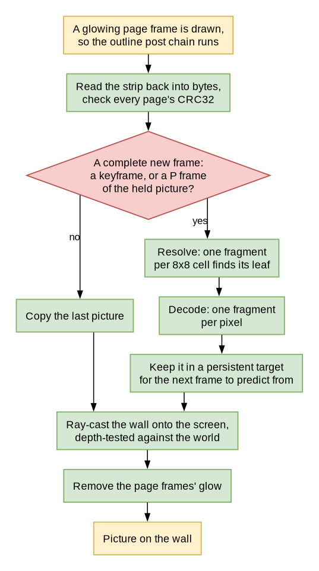
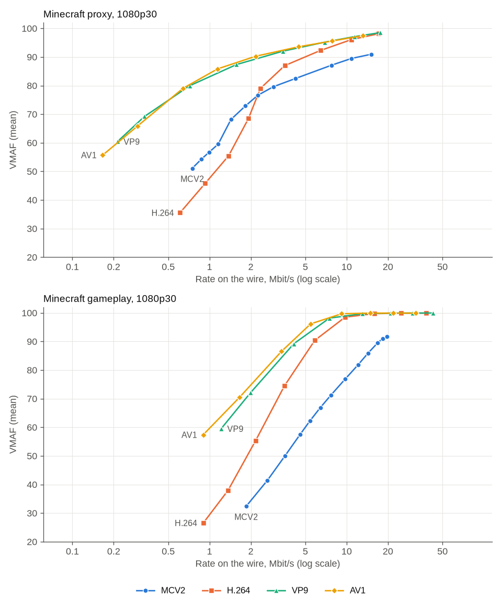
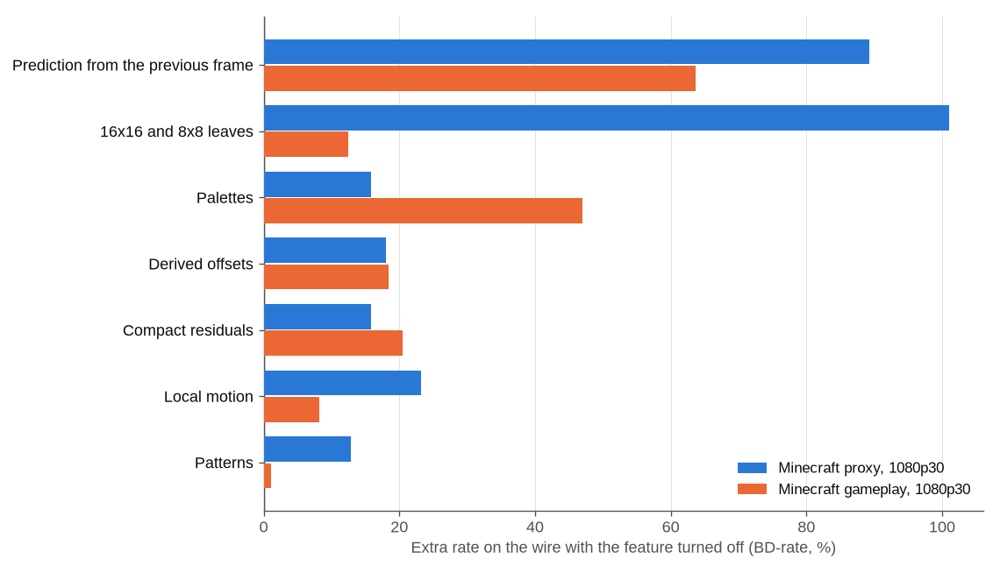

# MCV2: Video on Vanilla Minecraft Maps



*An MCV2 screen in a vanilla Minecraft 26.3 client. No mods: a resource pack's shaders decode the picture.*

MCV2 is a video codec I built for one very specific screen: a wall of maps in vanilla Minecraft. The server encodes
the video, sends every frame as the colours of a few maps, and a resource pack decodes it on the player's graphics
card. Players don't install anything. They accept a resource pack, and a 1920x1080 video plays on the wall in full
colour for a few megabits a second.

This page explains all of it, from the beginning. You don't need to know anything about video to read it: the first
parts explain what video is, what a codec does, and how people measure how good one is. Then come the reasons
Minecraft needs a codec of its own, every part of MCV2's format, how the encoder decides what to send, how the code
is organised, how well it does against the codecs the rest of the world uses, and how to use it. Every word that
might be new is explained the first time it shows up, and there is a glossary at the end. It is long. Read it in
order, and take breaks.

## Part 1: Video, From the Beginning

### Pixels and Colour

A screen is a grid of tiny squares called **pixels**. A 1920x1080 screen (people call it "1080p", or "Full HD") has
1,920 pixels across and 1,080 down, which is 1920 × 1080 = 2,073,600 pixels.

Each pixel shows one colour, and a computer stores that colour as three numbers: how much **red**, how much **green**
and how much **blue** light to mix. This is called **RGB**. Each number is one **byte**, a whole number from 0 to 255,
so a pixel is three bytes:

| Colour | Red | Green | Blue |
|---|---:|---:|---:|
| black | 0 | 0 | 0 |
| white | 255 | 255 | 255 |
| pure red | 255 | 0 | 0 |
| grass green in Minecraft (roughly) | 127 | 178 | 56 |
| mid grey | 128 | 128 | 128 |

Three bytes give 256 × 256 × 256 = 16,777,216 possible colours, more than the eye can tell apart.

A **picture** (or **image**) is just the colours of all the pixels, row by row: the top row from left to right, then
the next row, and so on. A 1080p picture takes 2,073,600 × 3 = 6,220,800 bytes, about 6.2 megabytes.

### Frames and Frame Rate

A **video** is a sequence of pictures shown one after another, fast enough that your eye sees motion instead of
separate pictures. Each picture in a video is a **frame**. The **frame rate** says how many frames are shown every
second, in **frames per second** (fps). Films are usually 24 fps, most online video 30 fps, and games and sports often
60 fps.

### How Big Is Raw Video?

Video stored as plain pixels, frame after frame, is called **raw** or **uncompressed** video. Let's work out how big
1080p at 30 fps is:

- one frame: 1,920 × 1,080 pixels × 3 bytes = **6,220,800 bytes**
- one second: 6,220,800 bytes × 30 frames = **186,624,000 bytes**, about 187 megabytes
- in bits (a byte is 8 bits): 186,624,000 × 8 = **1,492,992,000 bits a second**, about 1.5 gigabits a second
- one minute: 186,624,000 × 60 = 11,197,440,000 bytes, about 11.2 gigabytes
- a two-hour film: 186,624,000 × 7,200 = 1,343,692,800,000 bytes, about 1.3 terabytes

The speed of a network connection is measured in **bits per second**: a megabit per second (Mbit/s) is a million bits a
second. A good home connection gives maybe 100 Mbit/s. Raw 1080p30 needs about 1,493 Mbit/s, fifteen times that, and
a two-hour film would fill a large hard drive. Yet you can stream that film over a phone connection. The thing that
makes that possible is a codec.

### What a Codec Does

A **codec** is a pair of programs: an **encoder**, which turns raw video into far fewer bytes, and a **decoder**, which
turns those bytes back into pictures. (The name is short for **co**der-**dec**oder.) The bytes the encoder writes are
called the **bitstream**, or just the **stream**, and the exact rules for what those bytes mean are the codec's
**format**. Anyone who follows the format can write a decoder, and every decoder that follows it shows the same
pictures.

How many bits the stream uses for each second of video is its **bitrate**, or just its **rate**: the same video could
be 1,493 Mbit/s raw, 5 Mbit/s from a good codec, or 0.5 Mbit/s from the same codec told to save more. Fewer bits always
cost something: the pictures come out less like the original. The whole art of a codec is to throw away what you will
notice least.

### Why the World Runs on Codecs

Almost every picture that moves on a screen today went through a codec:

- **Streaming**: YouTube, Netflix and Twitch send codec streams; without them a single film would be over a terabyte.
- **Video calls**: a call sends your camera's picture both ways while you talk, so the encoder has to keep up live,
  frame by frame, and the stream has to fit whatever connection you have at that moment.
- **Phones and cameras**: the camera encodes as it records, otherwise a minute of video would fill the phone.
- **Storage**: every video file you have, every security camera's recording, every game's cut scenes is stored
  encoded.

The codecs doing that work have names you may have seen in a video's settings: **H.264** (also called AVC, from 2003,
still everywhere), **VP9** (Google's, used by YouTube), and **AV1** (the newest widely used one, from 2018). Later on
this page I compare MCV2 with all three.

## Part 2: The Ideas Every Codec Uses

Codecs differ in their details, but they're built from the same handful of ideas.

### Redundancy

Video is full of repetition, which codecs call **redundancy**:

- **Redundancy in space.** Neighbouring pixels usually look alike. A blue sky is thousands of nearly identical pixels;
  a wall in Minecraft is a few colours repeated. A codec can describe "this whole area is that blue" in a few bytes
  instead of storing every pixel.
- **Redundancy in time.** Consecutive frames usually look alike. At 30 fps, a frame comes 33 milliseconds after the one
  before, and in 33 milliseconds most of the picture hasn't changed. A codec can say "this part is the same as last
  time" almost for free.

### Prediction

Codecs exploit redundancy with **prediction**: the decoder makes a guess at a part of the picture from things it
already has, and the stream only says how to correct the guess. If the guess is good, the correction is small, and
small numbers take few bits. A frame that is predicted from an earlier frame is called a **P frame** (P for
predicted), and the earlier picture it predicts from is its **reference**. A frame that needs nothing else, because it
describes every part of the picture itself, is a **keyframe** (other codecs call it an I frame). A stream has to start
with a keyframe, and it sends one now and then so a viewer who joins late, or who missed a frame, can start again.

### Motion

When the camera pans or something moves, a part of the frame is still in the previous frame, just somewhere else. So
codecs store a **motion vector**: "take the pixels from 5 pixels to the left and 2 up in the reference". Copying moved
pixels like this is called **motion compensation**, and finding the best vector for each part of the picture is the
encoder's **motion search**. Most of a codec's encoding time goes into searching.

### Blocks

Codecs don't treat the frame as one thing. They cut it into square **blocks**, say 8x8 or 32x32 pixels, and decide for
each block how to code it: copy it from the reference, move it, describe it fresh, or correct a prediction. Big blocks
cost few bytes but describe detail badly; small blocks describe detail well but each costs bytes of its own. Good
codecs mix sizes: big blocks where the picture is plain, small ones where it's busy.

### Transforms Versus Palettes

How do you describe a block's pixels in few bytes? The big codecs use a **transform**: a bit of maths (usually the
discrete cosine transform) that rewrites a block's pixels as a sum of smooth wave patterns, from "the whole block is
this bright" to fine ripples. For most natural pictures only a few of those waves matter, so the codec keeps a few
numbers and drops the rest.

A **palette** is the other way. A palette block says "this block uses only these two colours" and then, for each
pixel, which of the two it is: one bit per pixel. That's perfect for hard edges and flat areas, like text, user
interfaces or Minecraft's blocks, where a transform needs many waves to draw a sharp edge. MCV2 uses palettes, not
transforms ([Part 4](#part-4-why-minecraft-maps-need-their-own-codec) explains why).

### Quantization: Trading Quality for Rate

**Quantization** means rounding numbers to a coarser step, so they take fewer bits. Rounding the brightness 117 to the
nearest multiple of 4 gives 116: one value in four is kept, so it needs two bits less, at the cost of an error of 1. The
**quantizer** sets the step: a bigger step means fewer bits and a worse picture.

That is the central trade of every lossy codec, between **rate** (bits) and **distortion** (how wrong the picture
is). Encoders decide it with a number usually called **lambda** (λ), the price of a bit: for every choice, the encoder
adds up its distortion plus lambda times its bits, and picks the cheapest. With a small lambda, bits are cheap, so it
spends many for a good picture; with a large lambda, it saves bits and accepts a worse picture. Turning that one knob
moves a codec along its whole range, from huge and sharp to tiny and blurry.

### Entropy Coding

**Entropy coding** writes common symbols with short codes and rare symbols with long ones, like Morse code gives E a
single dot. A good entropy coder squeezes out every bit of predictability that's left. The big codecs use clever ones
(CABAC in H.264, an arithmetic coder in AV1) whose state runs through the whole stream: to read any symbol, you have to
read every symbol before it. As you'll see, MCV2 can't do that, and that costs it a lot.

### Lossy and Lossless

A **lossless** codec gives back exactly the original bytes, like a ZIP file; a **lossy** codec gives back something
close, and is far smaller. Video codecs are lossy. Inside them, though, lossless pieces are common: the entropy coder is
lossless, and so is **zlib**, the general-purpose compressor (the same one inside ZIP files and PNG images) that
Minecraft runs over its network packets. That one matters a lot for MCV2.

## Part 3: Measuring Quality

To compare codecs you need to measure how good their pictures are. There are three numbers people use.

### PSNR

**PSNR**, the peak signal-to-noise ratio, compares pixels directly. First you take the **mean squared error** (MSE):
the average, over every pixel and colour channel, of (decoded value - original value)². Then

  PSNR = 10 × log₁₀(255² / MSE), in decibels (dB).

A worked example: four values of an original picture are 100, 100, 200, 200, and the decoded ones 101, 99, 200, 204.
The errors are 1, -1, 0 and 4; their squares 1, 1, 0 and 16; the MSE is (1 + 1 + 0 + 16) / 4 = 4.5. Then
255² / 4.5 = 65,025 / 4.5 = 14,450, and 10 × log₁₀(14,450) = 41.6 dB. Higher is better: identical pictures would have an
MSE of 0 and an infinite PSNR; around 40 dB the errors are hard to see; below 30 dB they are obvious. PSNR is easy to
compute, but it doesn't know what eyes notice: a picture shifted by one pixel looks the same to you and has a terrible
PSNR.

### SSIM

**SSIM**, the structural similarity index, compares small neighbourhoods of the two pictures instead of single pixels:
are they equally bright, equally contrasty, and do their patterns line up? It gives a number up to 1 (identical), and
it follows what people see better than PSNR does.

### VMAF

**VMAF**, Video Multimethod Assessment Fusion, is the one Netflix built to predict what viewers would say. It computes
several measures of detail and motion, and combines them with a model trained on thousands of scores that real people
gave to real videos. The result is a number from 0 to 100: around 90 and above, most people can't tell the video from
the original; 70 to 80 is clearly worse but watchable; below 50 it's bad. Every quality number on this page is VMAF
(the version 0.6.1 model), computed by ffmpeg's libvmaf on the decoded pictures against the original.

### Rate-Quality Curves

One encode gives one point: so many megabits a second for so much VMAF. Encode the same clip at several lambdas and you
get a **curve**: rate along the bottom, quality up the side. A better codec's curve sits higher (more quality for the
same rate) and further left (the same quality for less rate).

### BD-rate

To boil two curves down to one number, people use the **Bjøntegaard delta rate** (**BD-rate**): the average
difference in rate between the two curves for the same quality, as a percentage. "+20 % BD-rate" means the second codec
needs, on average, 20 % more bits than the first for the same VMAF; "-20 %" means 20 % fewer.

It's computed like this. Take the logarithm of each point's rate (so that "twice the rate" is the same distance
everywhere on the curve). Fit a smooth curve (a cubic polynomial) through each codec's points, log-rate as a function of
quality. Average the gap between the two fitted curves over the quality range both of them reach. Turn that average gap
of logarithms back into a percentage.

Here's a real example, from later on this page: MCV2 on the proxy clip, once with all its tools and once with its
patterns turned off, at six lambdas each.

| λ | Rate with patterns | VMAF | Rate without patterns | VMAF |
|---:|---:|---:|---:|---:|
| 19 | 7.72 Mbit/s | 86.9 | 8.57 Mbit/s | 87.0 |
| 34 | 4.19 Mbit/s | 82.4 | 4.70 Mbit/s | 82.1 |
| 65 | 2.24 Mbit/s | 76.6 | 2.45 Mbit/s | 75.0 |
| 138 | 1.40 Mbit/s | 68.3 | 1.48 Mbit/s | 66.5 |
| 254 | 0.98 Mbit/s | 57.1 | 1.06 Mbit/s | 60.1 |
| 500 | 0.74 Mbit/s | 52.3 | 0.73 Mbit/s | 50.5 |

You can see that the second column of rates is higher at every λ but the last, where the quality is lower too. And
the qualities don't line up exactly, so you can't just divide one rate by the other. The BD-rate takes care of that:
over the VMAF range both reach, 52 to 87, the curve without patterns needs on average 11.4 % more rate for the same
quality. So turning patterns off costs **+11.4 % BD-rate** on this clip. (Notice the point at λ = 254, where the
encoder without patterns happened to land on a higher quality: real measurements are a little noisy, and fitting a
smooth curve through all six points averages that out.)

## Part 4: Why Minecraft Maps Need Their Own Codec

### What a Map Is

In Minecraft, a **map** is an item that shows a 128x128 picture. In an **item frame** on a wall, a map shows its
picture on that block, and a wall of item frames with maps in them makes a big screen. The server sends each map's
picture to the client in **map packets**.

A map's picture isn't RGB. Every pixel is one byte: the number of one of the 248 **map colours** of Minecraft 26.3 (62
base colours in four shades each, where the four shades of the first are transparent). So a map is 128 × 128 = 16,384
bytes, and to show a 1080p picture you need a wall 1920 / 128 = 15 maps wide and 1080 / 128 = 8.4, so 9, maps high: 135
maps, 135 × 16,384 = 2,211,840 bytes of map colours for one frame.

### How MCAV Played Video Before

MCAV has always played video on maps by **dithering**: turning every frame into the nearest map colours, mixing
neighbouring pixels of different colours where no map colour is close enough, and sending the map colours that changed
since the last frame. Every client can show that without any help. But the numbers are bad. Here is what dithered maps
send at 1080p and 30 fps, after Minecraft's own packet compression, with VMAF (measured with the former
`tools/mcv2/DitherBench.java`; its exact command is
`dither_command` in `codec_curves.json`, and the clips are described in [The Test Clips](#the-test-clips)):

| Content | Under the plugin's default budget (128 KiB per frame and viewer) | Every change sent |
|---|---|---|
| Minecraft proxy | 10.4 Mbit/s, VMAF 33.4 | 125.5 Mbit/s, VMAF 96.9 |
| Minecraft gameplay | 10.9 Mbit/s, VMAF 10.9 | 178.3 Mbit/s, VMAF 99.5 |

Showing every frame takes over a hundred megabits a second for each player, which no server can give. With a budget,
the wall falls behind: some maps show the current frame and some a frame from seconds ago, and on gameplay the wall
becomes a mosaic of different moments (that's why its VMAF is 10.9). And the picture is stuck at 128 pixels per map,
whatever the video's real resolution.

### What a Vanilla Client Gives Us

A mod could decode video with anything, but then every player would have to install it. I wanted MCV2 to work for
anyone who accepts a **resource pack**: the zip file of textures, sounds and shaders a server can ask a client to load,
which needs no installing. So MCV2 can only use what an unmodified client does with a resource pack:

- **Map colours arrive exactly.** The client copies a map's bytes into a texture on the graphics card as they are. 64
  of the map colours can still be told apart exactly after the client has drawn them, so one map pixel can carry 6 bits
  of data (2⁶ = 64), and a whole map 16,384 × 6 / 8 = 12,288 bytes.
- **A resource pack can replace the game's shaders.** A **shader** is a small program that runs on the graphics card
  (the **GPU**), written in a language called GLSL. A pack can replace the shaders that draw text and maps, and the
  **post effect** that draws the outline around glowing entities. A post effect is a chain of full-screen shader
  passes the game runs after it has drawn the world.
- **A post effect can keep pictures between frames.** Its render targets can be marked persistent, and then they survive
  from one rendered frame to the next. That's where the previous decoded picture can live, so P frames are possible.

That's all. No other way to store anything, no files, no network, and no compute shaders. The decoder has to be a
**fragment shader**: a program the GPU runs once for every pixel it draws, thousands at the same time, each one on its
own, none of them able to see what the others computed.

That one fact shapes the whole codec. Every pixel has to find its own data in the frame's bytes directly, in a bounded
number of steps, without reading the frame from the start. So:

- **no entropy coder whose state runs through the stream**: a pixel would have to decode every symbol before its own;
- **no prediction from neighbouring blocks**, the trick every modern codec uses to describe a block from the pixels
  above and to the left of it: the neighbours are being decoded at the same moment;
- **every address findable**: a pixel must be able to work out where its block's data starts without adding up the
  sizes of everything before it;
- **no transform**: a transform pays off because an entropy coder writes its few important numbers in very few bits;
  stored plainly, those numbers cost more than they save. For Minecraft's flat colours and hard edges, a palette is
  smaller and sharper anyway. MCV2 keeps one smooth tool, a coarse grid of corrections on top of a moved picture, which
  is cheap to store and to decode.

### Packets and zlib

The server sends every map picture in a map packet. Minecraft compresses every packet over its compression threshold
(256 bytes, by default) with zlib before it goes on the network, and decompresses it on the client. That changes what
it costs to send MCV2: a map byte that carries 6 bits of MCV2 data is one of only 64 values, and zlib squeezes that
kind of byte back down well. So **every MCV2 rate on this page is measured after zlib**: the bytes that actually cross
the network.

MCV2 is the codec that fits in that box: a server encodes the video into a bitstream built so that a fragment shader
can decode any pixel on its own, sends it as the colours of a few maps per frame, and the pack's shaders decode it and
draw it over the wall.

## Part 5: How a Frame Gets to the Screen



*Everything on the left runs in `mcav-bukkit` on the server; everything on the right runs in the resource pack of a
vanilla client. Nothing but map packets and one resource pack reaches the client.*

Here is the whole trip of one frame, in five steps. The rest of the page goes through each one in detail.

1. **Encode.** The encoder decides whether the frame is a keyframe or a P frame, and then, for every 32x32 square of
   the picture, finds the cheapest way to describe it: skip it (it's the same as last frame), move it, paint it with
   one colour, two colours or a pattern, or correct a prediction with a small residual. It can cut a square into four
   16x16 squares, and those into 8x8 ones, wherever smaller pieces pay for themselves.
2. **Write.** The choices are written into the frame's bytes: a 20-byte header, an index that lets every pixel find its
   own data, and the data itself.
3. **Send.** The frame is cut into **pages** of up to 12,256 bytes, each with a 32-byte header and a checksum. Every
   page becomes one 128x128 map, six bits per map pixel. The pages of a frame go out together as map packets, and
   Minecraft's zlib compresses them on the way.
4. **Decode.** On the client, the pack's text shaders move the page maps into a strip at the top of the screen, and a
   post effect reads them back into bytes, checks every page, finds every pixel's data, rebuilds the picture, and keeps
   it for the next frame to predict from.
5. **Show.** The same post effect draws the picture over the wall of maps, behind anything that stands in front of it.

## Part 6: The MCV2 Format, Piece by Piece

This part is the full specification of an MCV2 frame, version 3: enough to write your own decoder. The normative
definition is this text together with the independent Python reference decoder in `mcav-bukkit/src/test/python/mcv2_reference.py`; MCAV's Java
decoder (`Mcv2Decoder`) and the resource pack's shader decode every test frame to exactly the same pictures.

A few conventions first. All numbers are whole numbers. A number of more than one byte is stored with its lowest byte
first (that's called **little-endian**): the two bytes `0x34 0x12` are the number `0x1234` = 4,660. Numbers are
unsigned (never negative) unless I say **signed**; a signed byte (s8) runs from -128 to 127, and a signed 4-bit value
(s4) from -8 to 7. Inside a byte, bits are counted from the lowest (bit 0 is worth 1, bit 7 is worth 128). An **offset**
is a position in the frame's bytes, counted from 0. `0x` in front of a number means it is written in hexadecimal.

### The Frame Header

Every frame starts with 20 bytes:

| Offset | Size | Field | What it holds |
|---:|---:|---|---|
| 0 | 4 | magic | the letters `MCV2` (the number `0x3256434D`), so a decoder knows what it's looking at |
| 4 | 4 | version | 3 |
| 8 | 2 | width | the picture's width in pixels, 1 to 4096 |
| 10 | 2 | height | the picture's height, 1 to 4096 |
| 12 | 4 | frame id | this frame's number |
| 16 | 4 | reference id | the frame a P frame predicts from; a keyframe repeats its own id here |

That's all. A frame is a keyframe exactly when its reference id equals its frame id, so no flag says it. The frame's
length is the length of whatever carries it (the pages it arrived in, or a file's length prefix), at most 131,071
bytes, and where the leaf data begins follows from the index, so the header doesn't store those either. Every field
starts at a multiple of its own size, so a decoder reads each one in a single step.

A frame of an older version (`MCV1`, or `MCV2` with version 2) is refused with a message that says so.

The **frame id** goes up by one every frame. It is a 32-bit number, so after 4,294,967,295 it wraps around to 0; a
decoder treats a frame as newer than the last one when the difference, counted the same wrap-around way, is between 1
and 2,147,483,647. A **P frame** names the frame it predicts from in its **reference id**, and a decoder that doesn't
have that frame's picture simply doesn't decode it and keeps showing what it has. Every P frame MCAV writes predicts
from the frame right before it.

### Superblocks and the Block Tree

The picture is cut into **superblocks**: squares of 32x32 pixels, counted in rows from the top left. A picture of
width `w` has `columns = ceil(w / 32)` superblocks per row (`ceil` rounds up), and the superblock number `i` has its
top left corner at x = 32 × (i mod columns), y = 32 × (i div columns). A 1920x1080 picture has 60 columns and 34
rows: 2,040 superblocks. Because 1080 isn't a multiple of 32, the last row of superblocks hangs 8 pixels below the
picture; those pixels are decoded like any others but never shown.

Each superblock is a small **tree**. Its **root** is the 32x32 square itself. A square is either a **leaf**, which says
how to draw all of its pixels, or a **split** into four squares of half its size, in the order top left, top right,
bottom left, bottom right. Only 32- and 16-pixel squares can split, so every leaf is 32, 16 or 8 pixels across. In a
quiet area, one 32x32 leaf covers 1,024 pixels; around a busy edge, the encoder splits down to 8x8 leaves.



*A piece of two frames of the gameplay clip as MCV2 coded them. Top: the decoded picture with every leaf outlined;
bottom: every leaf coloured by its mode. In the keyframe (left), the sky and the dark mass of leaves are mostly SOLID
leaves, big ones in the sky, and where the trees meet the sky the squares are split smaller and many become palettes.
Twelve frames later (right), the camera has turned: most squares are unchanged (SKIP), moved copies of the last
picture (MOTION) or corrected ones (COMPACT), and only the detail coming into view gets palettes and patterns. The whole keyframe is 61,275 bytes in 6,471 leaves; the P frame 27,501 bytes in 3,345.*

### The Leaf Types

Every leaf has a **mode**, which says how its pixels are made, and a **record**: the bytes that mode needs. There are
six leaf modes; `s` is the leaf's size (32, 16 or 8):

| Mode | Name | Record | Allowed in | What the decoder draws |
|---:|---|---|---|---|
| 0 | SKIP | nothing | every frame | P frame: the same pixels as the reference. Keyframe: black |
| 1 | MOTION | 2 bytes | P frames | the reference, moved |
| 2 | SOLID | 3 bytes | every frame | one colour |
| 3 | PALETTE | 6 + s²/8 bytes | every frame | two colours, a bit per pixel says which |
| 4 | PATTERN | 7 + s/8 bytes | every frame | two colours in stripes |
| 5 | COMPACT | 10 bytes | P frames | the reference, moved, plus a small correction |
| 6 | SPLIT | (no record) | 32- and 16-pixel squares | four smaller squares |

**SKIP** costs nothing but its place in the tree. In a P frame, a skipped square shows exactly what the same square
showed in the reference: on a still picture, almost every square is a SKIP. A keyframe has no reference, so there a
skipped square is black (MCAV's encoder never writes one: a keyframe describes every square).

**MOTION** is two signed bytes, `dx` and `dy`: pixel (X, Y) of the leaf shows the reference's pixel at (X + dx, Y + dy).
If that lands outside the picture, the nearest edge pixel is used (in maths, the coordinate is **clamped** into the
picture). So a vector can reach up to 127 pixels in any direction. Vectors are whole pixels: there is no "half a pixel
to the left".

**SOLID** is three bytes, red, green and blue, and every pixel of the leaf has that colour.

**PALETTE** is two colours (six bytes: R0, G0, B0, R1, G1, B1) and then one bit for every pixel, row by row: bit 0 of
the first selector byte is the top left pixel, bit 1 the pixel to its right, and so on. A 0 bit means colour 0, a 1 bit
colour 1. An 8x8 palette is 6 + 64/8 = 14 bytes, a 16x16 one 38, a 32x32 one 134.

**PATTERN** is a palette whose bits repeat along one direction: stripes, which are everywhere in Minecraft (fences,
planks, bars). Its record is the two colours and then a **selector word**: an orientation byte (0 when the stripes
are vertical, so each column has one colour; 1 when they're horizontal) and `s/8` bytes with one bit per column (or
row). An 8x8 pattern is 6 + 1 + 1 = 8 bytes instead of a palette's 14, a 32x32 one 6 + 1 + 4 = 11 instead of 134.



*Two real leaves from the same keyframe. Top: a 32x32 PALETTE leaf where the trees meet the sky. Its record is the two
colours and 1,024 bits, one per pixel: 134 bytes. Bottom: a 16x16 PATTERN leaf at the edge of a cloud, where every
column has a single colour. Its record is the two colours, the orientation byte and 16 bits, one per column: 9 bytes
for 256 pixels.*

**COMPACT** is a correction on top of a moved copy of the reference: "take this block from the last frame, moved by
(dx, dy), and make it a little brighter at the top left". It's how MCV2 handles things that move and change a bit at
the same time. Its record is always 10 bytes: dx and dy as two signed bytes, like MOTION's, and then 16 brightness
changes on a 4x4 grid, s4 values, two to a byte. The grid is spread smoothly over the whole leaf, whatever its size
(the next section has the exact rule), so 16 numbers describe a gentle change across an 8x8 or a 32x32 block. The same
change is added to red, green and blue, so the block gets brighter or darker without changing its colour: brightness
changes far more than colour in real pictures. The descriptor's **quantizer** `q` (0, 1 or 2, below) scales the
correction by 2^q: q = 0 means steps of 1, q = 2 steps of 4.

### Reconstruction: The Exact Rules

Every leaf is drawn on its own, from its record, the reference picture and nothing else; no leaf looks at another
leaf. To decode bit for bit the same pictures as every other MCV2 decoder, follow these rules exactly.

- **Prediction** (SKIP in a P frame, MOTION, COMPACT): pixel (X, Y) with vector (dx, dy) takes the reference's pixel at
  (clamp(X + dx, 0, w - 1), clamp(Y + dy, 0, h - 1)), each colour channel a whole number from 0 to 255.
- **The grid** (COMPACT): node n of the 4x4 grid is in row n div 4, column n mod 4; node 2j is the low four bits of
  the record's byte 2 + j and node 2j + 1 the high four bits, read as s4. For a pixel at position p (0 to s - 1) along one
  side of the leaf, take t = (p + 0.5) × 4 / s - 0.5, clamped to 0 to 3; i0 = the whole part of t, i1 = min(i0 + 1, 3),
  f = t - i0. Do that for x and for y, and blend the four nodes around the pixel: Y = (1 - fy) × ((1 - fx) × N[iy0][ix0]
  + fx × N[iy0][ix1]) + fy × ((1 - fx) × N[iy1][ix0] + fx × N[iy1][ix1]). This is called **bilinear interpolation**.
- **The colour**: each of red, green and blue becomes v = P + 2^q × Y, with P that channel of the prediction; the
  output is v rounded to the nearest whole number, halves rounded up (floor(v + 0.5)), then clamped to 0 to 255.
- **Why it's exact**: f is always a multiple of 1/(2s), so every Y is a multiple of 1/(4s²) (at most 1/4,096), and no
  value needs more than 21 significant bits: a GPU's 32-bit floating point numbers hold every value exactly, and a
  program working in whole numbers can multiply everything by 4s² and never round at all.

A worked example. A 16x16 COMPACT leaf with the vector (0, 0), q = 2, and every row of nodes -2, -1, 0, 1, over a
reference pixel (100, 120, 140). For the pixel at x = 2: t = (2 + 0.5) × 4 / 16 - 0.5 = 0.125, so i0 = 0, i1 = 1,
f = 0.125, and Y = 0.875 × (-2) + 0.125 × (-1) = -1.875 (every row is the same, so y doesn't matter). Every channel
gets 4 × (-1.875) = -7.5: red 100 - 7.5 = 92.5, which rounds up to 93; green 112.5, so 113; blue 132.5, so 133. The
pixel is (93, 113, 133).

### The Index: How One Pixel Finds Its Leaf

This is the part of MCV2 that exists only because of the fragment shader. Remember: every pixel is decoded by its own
little program, at the same time as all the others. Each one has to answer, on its own and quickly: which leaf covers
me, and where are that leaf's bytes? Storing a full address for every leaf would cost a lot of bytes; scanning the
frame from the start would take every pixel thousands of steps. The index solves it with a few small tables and
counting.

The index starts right after the header. With R superblocks, G = ceil(R / 32) groups of 32 superblocks,
C = ceil(G / 8), and D descriptors in all (below), it is:

| Part | Bytes | What it holds |
|---|---|---|
| presence masks | 4 × G | a 32-bit number per group: bit b of mask g is 1 when superblock 32g + b is present |
| directory | 4 × C | for every eighth group: how many present superblocks come before it |
| level counts | 12 | three 32-bit numbers: n0, n1 and n2, the descriptors of 32-, 16- and 8-pixel squares |
| descriptors | D | one byte per square, in level order |
| walk checkpoints | 4 × ceil(D / 8) | one 32-bit number per eight descriptors |

and the leaf records begin right after it, at 20 + 4G + 4C + 12 + D + 4 × ceil(D / 8) (the **payload start**), one
after another with no gaps; the last one ends exactly at the end of the frame.

**Presence.** A superblock whose bit is 0 isn't stored at all: it's one 32x32 SKIP. On a still picture most bits are 0,
and a whole 1080p P frame where nothing moved is just the header and a 300-byte index: 320 bytes. To find where a present superblock's
descriptor is, count how many present superblocks come before it: the directory gives the count up to the start of its
group of eight, then add the number of 1 bits (the **popcount**) of at most seven whole masks, and of the bits of its
own mask below its bit. Counting the 1 bits of a 32-bit number takes the shader a handful of operations (a classic
bit trick, since the GLSL version Minecraft uses has no function for it), so seven masks cost almost nothing.

**Descriptors.** A descriptor is one byte, `mode + 32 × q`: the mode in the low five bits and the quantizer q in the
high three (q is zero unless the mode is COMPACT). The descriptors are stored in **level order**: first one for every
present superblock (level 0, n0 of them), then the four children of every level-0 split, split by split (level 1, n1 =
4 × the splits in level 0), then the children of every level-1 split (level 2, n2). A descriptor's number d tells its
size: 32 if d < n0, 16 if d < n0 + n1, else 8. And the four children of the split with number d start at
n0 + 4 × (the number of splits among descriptors 0 to d - 1). No pointers anywhere: just counting.

**Walk checkpoints.** Two things still need counting: the splits before a descriptor (for its children), and the
total length of the records before it (for where its record starts). Counting from the start would be too slow, so
every eighth descriptor has a **checkpoint**: one 32-bit number holding the record bytes before it (the **cursor**, in
the low 17 bits) and the splits before it (in the high 15 bits). From the checkpoint just before it, a pixel walks
over at most seven descriptors, adding up their record lengths and counting their splits. A record's length always
follows from its mode and its size alone, so the walk reads one byte per descriptor: the descriptor itself. Since a frame is at most 131,071 bytes, the cursor
always fits in 17 bits, and there are always fewer than 32,768 splits.

Here's a worked example: a 96x64 picture with 6 superblocks (3 columns, 2 rows). Superblocks 0, 2, 3 and 5 are present,
so the one presence mask is the bits 0, 2, 3 and 5: 1 + 4 + 8 + 32 = 45, and n0 = 4. Superblock 2 is split, and its
bottom right child is split again, so n1 = 4 and n2 = 4: twelve descriptors, two walk checkpoints.

| Descriptor | Square | Mode | Record bytes | Checkpoint |
|---:|---|---|---:|---|
| 0 | superblock 0 | SOLID | 3 | 0: cursor 0, splits 0 |
| 1 | superblock 2 | SPLIT | 0 | |
| 2 | superblock 3 | MOTION | 2 | |
| 3 | superblock 5 | SOLID | 3 | |
| 4 | 16x16 at (64, 0) | PALETTE | 38 | |
| 5 | 16x16 at (80, 0) | SOLID | 3 | |
| 6 | 16x16 at (64, 16) | COMPACT | 10 | |
| 7 | 16x16 at (80, 16) | SPLIT | 0 | |
| 8 | 8x8 at (80, 16) | SOLID | 3 | 1: cursor 59, splits 2 |
| 9 | 8x8 at (88, 16) | ... | | |

Which leaf covers the pixel (80, 20)? Its superblock is column 80 / 32 = 2, row 20 / 32 = 0, so number 2. Bit 2 of the
mask is set, so it's present, and the bits below it (bit 0 only) count 1: descriptor 1. Walk from checkpoint 0 over
descriptor 0 (3 bytes): cursor 3, splits 0. Descriptor 1 is a SPLIT, so its children start at n0 + 4 × 0 = 4; the pixel
is in the right half (80 - 64 = 16, not below 16) and the bottom half (20 ≥ 16) of the superblock, child 3: descriptor
7. Walk from checkpoint 0 again, over descriptors 0 to 6: cursor 3 + 0 + 2 + 3 + 38 + 3 + 10 = 59, splits 1 (descriptor
1). Descriptor 7 is a SPLIT too, so its children start at 4 + 4 × 1 = 8, and the pixel is in its top left quarter:
descriptor 8. Its checkpoint (number 1) already holds cursor 59 and splits 2, and descriptor 8 is a SOLID leaf whose
three bytes start at payload start + 59. Three levels, a handful of additions. No pixel ever needs more than three
rounds of at most seven steps, whatever the frame holds.

### Validation: Never Trust the Bytes

A decoder must assume a frame could be broken or even malicious, so it checks everything before using it, and never
reads outside the frame. MCAV's Java decoder and the Python reference accept a frame if and only if all of these hold:

- the length is 20 to 131,071 bytes, the magic is right, the version is 3, and the width and height are 1 to 4,096;
- the index fits in the frame; every directory entry is the right count; no mask
  bit is set past the last superblock; n0 equals the number of present superblocks, n1 is four times the splits of
  level 0, n2 four times those of level 1, and level 2 has no split;
- every walk checkpoint holds exactly the right cursor and split count;
- every descriptor has a mode that exists and is allowed there (no MOTION or COMPACT in a keyframe, no SPLIT at 8
  pixels), q is zero unless the mode is COMPACT and at most 2 for a COMPACT, every record lies inside the frame, and
  a PATTERN's orientation byte is 0 or 1;
- the records end exactly at the end of the frame.

Everything that rule doesn't forbid is allowed, even when MCAV's encoder never writes it, like a present superblock
that is a SKIP anyway.

### A Real Frame, Byte by Byte

Here is a whole frame, all 71 bytes of it: the first frame MCAV's encoder writes, at the `DEFAULT` preset, for a
64x32 piece of sky at the edge of a cloud, cut out of the gameplay clip. Two superblocks, side by side.



*The left superblock is one SOLID leaf; the right one is split into four 16x16 leaves: three SOLIDs and a PATTERN.*

```text
offset  bytes
     0  4d 43 56 32 03 00 00 00 40 00 20 00 00 00 00 00
    16  00 00 00 00 03 00 00 00 00 00 00 00 02 00 00 00
    32  04 00 00 00 00 00 00 00 02 06 02 02 02 04 00 00
    48  00 00 91 b2 fa 91 b2 fa 97 b6 f9 91 b2 fa 92 b3
    64  fa bc ce f6 00 f0 ff
```

| Offset | Bytes | Field | Value |
|---:|---|---|---|
| 0 | `4d 43 56 32` | magic | the letters `MCV2` |
| 4 | `03 00 00 00` | version | 3 |
| 8 | `40 00` | width | 0x0040 = 64 |
| 10 | `20 00` | height | 0x0020 = 32 |
| 12 | `00 00 00 00` | frame id | 0 |
| 16 | `00 00 00 00` | reference id | 0, its own id: so it's a keyframe |
| 20 | `03 00 00 00` | presence mask | bits 0 and 1 are set: both superblocks are present |
| 24 | `00 00 00 00` | directory | no present superblocks before the first group |
| 28 | `02 00 00 00` `04 00 00 00` `00 00 00 00` | level counts | n0 = 2, n1 = 4, n2 = 0 |
| 40 | `02` | descriptor 0 | SOLID: superblock 0 is one colour |
| 41 | `06` | descriptor 1 | SPLIT: superblock 1 becomes four 16x16 squares |
| 42 | `02 02 02 04` | descriptors 2 to 5 | SOLID, SOLID, SOLID, PATTERN, in the order top left, top right, bottom left, bottom right |
| 46 | `00 00 00 00` | walk checkpoint 0 | cursor 0, splits 0 |
| 50 | `91 b2 fa` | superblock 0's SOLID | (145, 178, 250), the sky |
| 53 | `91 b2 fa` | the top left SOLID | the same sky |
| 56 | `97 b6 f9` | the top right SOLID | (151, 182, 249) |
| 59 | `91 b2 fa` | the bottom left SOLID | the sky again |
| 62 | `92 b3 fa bc ce f6 00 f0 ff` | the PATTERN | colours (146, 179, 250) and (188, 206, 246), orientation 0, and the column bits `f0 ff` |

Check where the records start: 20 for the header, 4 for one mask, 4 for one directory entry, 12 for the counts, 6
descriptors and 4 for one walk checkpoint make 50. The records follow: four SOLIDs of 3 bytes and a PATTERN of 9, 7 +
16/8, ending at 71, the frame's length. The pattern's orientation 0 means its bits go across, one per column: `0xf0`
is 11110000 in binary, so read from bit 0, columns 0 to 3 get colour 0 and columns 4 to 7 colour 1, and `0xff` gives
columns 8 to 15 colour 1. That's the darker blue strip on the left of the bottom right square: the edge of the cloud.
A keyframe has no picture to fall back on, so it describes every square, even plain sky; in a P frame, the squares
that didn't change would be SKIPs and cost nothing but their place in the tree.

## Part 7: Pages on Maps


*A frame is cut into pages, every page becomes a map, and the client only decodes a frame whose pages all arrived
intact.*

A frame doesn't go to the client as it is: it travels as **pages**. A page is a 32-byte header followed by a slice of
the frame:

| Offset | Size | Field | Rule |
|---:|---:|---|---|
| 0 | 4 | magic | `MCP1` |
| 4 | 1 | version | 1 |
| 5 | 1 | symbol bits | 6 |
| 6 | 2 | frame type | 1 for a keyframe, 0 for a P frame |
| 8 | 4 | stream id | chosen by the server; a client only takes pages of its own streams |
| 12 | 4 | frame id | the frame's |
| 16 | 2 | page number | below the page count |
| 18 | 2 | page count | how many pages the frame has |
| 20 | 4 | reference id | the frame's |
| 24 | 4 | frame length | 32 to 131,071 |
| 28 | 4 | CRC32 | a checksum of the header (with this field zero) and the page's slice |

A **CRC32** is a 32-bit checksum: a number computed from the bytes so that almost any damage (a changed bit, a lost
byte) gives a different number. The client recomputes it and throws a damaged page away. It catches accidents; it isn't
a password, and it doesn't prove who sent the page.

**Symbols.** A page's bytes are read as one long row of bits, lowest bit of each byte first, and cut into groups of
six: each group is a **symbol**, a number from 0 to 63. A page holds 12,256 frame bytes, because (32 + 12,256) × 8 / 6
= 16,384 symbols: exactly one 128x128 map. Symbol `v` is sent as the map colour `v + 4`: the colour numbers 4 to 67,
the four shades of the base colours 1 to 16, whose 64 RGB colours are all different, so the client's texture tells
them apart exactly. The 244 opaque map colours could carry almost 8 bits per pixel, but a symbol has to be read back
from the colour the client draws, so it uses 64 exactly distinguishable ones: 6 bits.

**Packets.** The server writes page `n` of a frame into the top rows of the map numbered `pageMap + n` (a shorter last
page fills only whole rows of 128), one map packet per page, and sends all of a frame's pages in one bundle so they
arrive together. Minecraft's zlib then compresses each packet, and because a map byte carrying six bits uses only 64 of
its 256 values, zlib takes back a good part of the six-bit cost.

**Reassembly.** Pages can arrive in any order. A client keeps at most four unfinished frames; a page of a fifth evicts
the oldest. A page must agree with the pages it already has for its frame (count, reference id, length and type), and a
repeated page must be exactly the same, or the whole frame is dropped. When all pages are there, their slices are joined
in order into the frame.

**One stream, many viewers.** A screen is encoded once, and every viewer gets it through a link of their own, which
sends a frame only when that viewer can decode it (a keyframe, or a P frame whose reference that viewer was sent) and
only while that viewer's connection isn't already holding too much unsent video (128 KiB, twice that for a keyframe, by
default). A viewer whose connection falls behind skips to the next frame they can decode, and the others aren't held
back.

A screen has at most 8 page slots, so a frame can be at most 8 × 12,256 = 98,048 bytes on a wall. The encoder knows
that and keeps every frame inside it (Part 9).

## Part 8: Decoding in the Shader



*The post chain runs on every rendered frame while a page frame is in view. A frame that is incomplete, damaged or
missing its reference is never decoded: the client keeps showing the last picture.*

**The hook.** Minecraft runs the post effect `post_effect/entity_outline.json` after drawing the world whenever a
glowing entity is in view, and a post effect can declare render targets `"persistent": true`, which survive from one
frame to the next. That's the whole foundation: the first gives the decoder somewhere to run every frame, the second
somewhere to keep the previous picture. So every MCV2 screen hides **page frames** two blocks behind its wall:
invisible item frames holding the page maps, glowing on a team of their own, shown only to players who loaded the
pack. The last pass removes their outline colour, so nobody ever sees the glow.

**The strip.** The pack's `core/text.vsh` sees every map the client draws. A page map, recognised by the `MCP1` at its
start, has its square moved to its own slot in a strip of rows at the top of the screen, and `core/text.fsh` writes
its symbols there unchanged, four six-bit symbols into the three bytes of one screen pixel. Every other map, sign and
piece of text is drawn exactly as vanilla draws it.

**The anchors.** The screen's own maps carry small anchor patches in their top rows: a signature, their column and row
in the wall, the wall's size and facing, and a checksum. The vertex shader of any visible anchor writes the wall's
corner, its directions and the camera's projection into a row of the strip. That's how the post chain learns where the
wall is.

**The passes.** Each pass of the post chain is a fragment shader run over a small target:

1. *bytes*: reads the strip back into the frame's bytes;
2. *crc*: recomputes every page's CRC32, in chunks of 192 bytes, one fragment per chunk;
3. *pages*: checks every page's header and checksum;
4. *status*: decides whether this rendered frame brings a complete, undamaged, new frame the client can decode: a
   keyframe with a new frame id, or a newer P frame whose reference is the picture it holds;
5. *resolve*: one fragment per 8x8 cell of the picture finds the cell's leaf with the index (leaves are at least 8x8
   and line up with the cells, so all 64 pixels of a cell share the answer);
6. *decode*: one fragment per pixel draws the pixel from its leaf: SKIP and MOTION go straight to the held picture,
   every other leaf reads only its own record;
7. *copy* and *state*: keep the new picture and its frame id in persistent targets, for the next frame to predict from;
8. *view* and *screen*: work out where the wall is on the screen, and draw the picture over it, pixel by pixel, behind
   anything that stands in front of the wall;
9. *outline*: remove the page frames' glow.

No step loops over other pixels, and every loop has a fixed limit, so a broken frame can't make a fragment run forever
or read outside its textures. A keyframe with a new id is always taken, even when its id is smaller than the last
one: that's how a restarted server starts over without the players reloading anything.

**One file.** All of that is in one shader source file, `assets/mcav/shaders/include/mcv2.glsl`. Minecraft's post
effect format wants a program file for every pass, so each pass has a stub of a few lines that selects its part of the
file and includes it:

```glsl
#version 330
#extension GL_ARB_separate_shader_objects : require
#define MCV2_PASS_DECODE
#include <mcav:mcv2_config.glsl>
#include <mcav:mcv2_screen.glsl>
#include <mcav:mcv2.glsl>
```

`mcv2_config.glsl` and `mcv2_screen.glsl` are generated by the server when it builds the pack: they hold only numbers
(the video sizes, the page slots, the stream ids, the 64 map colours), no code.

**The resource pack.** The server builds the pack and serves it for pack format 97 (Minecraft 26.3). Its shaders are
fixed; only those generated numbers depend on the server. One pack decodes every MCV2 screen of the server, up to eight
at once, each in a slot of its own video size, so screens of sizes the pack already has start and stop without anyone
reloading. It is optional: offered with `required: false`, and a player who declines keeps seeing the dithered maps of
the same wall. Minecraft 26.3 compiles every shader through SPIR-V and back into GLSL 330, and the pack is written for
that path; it replaces vanilla's `core/text.vsh`, `core/text.fsh` and `post_effect/entity_outline.json` with copies
that are vanilla's plus the decoder.

**One held picture.** The pack keeps exactly one picture per screen: the last frame it decoded. A client that misses a
frame (it draws fewer frames a second than the video has, looks away, or reloads its resources) can't decode the P
frames after it, and keeps the last picture until the next keyframe, at most four seconds later at 30 frames a second.

## Part 9: The Encoder

The format only says what the bytes mean. How the encoder chooses them is up to the encoder: any stream that follows
the format decodes the same everywhere. MCAV's encoder is the class `MCV2`, and this part explains what it does with
each frame. It's fast enough to encode 1080p video while it plays, and it's also what encodes video files ahead of
time.

### Keyframe or P Frame

A frame becomes a **keyframe** when there's nothing to predict from: the first frame, a frame of a new size, a viewer
who just started watching and holds no picture yet (the screen asks for a keyframe then), and every 120th frame (four
seconds at 30 fps), so a viewer who missed something never waits longer than that. Every other frame is a P frame
that predicts from the frame just before it, even across a cut to a completely different picture: there the P frame
simply uses SOLID, PALETTE and PATTERN leaves like a keyframe would.

### Motion Search

For every 32x32 and 16x16 square of a P frame, the encoder looks for the vector that best predicts it from the last
picture. Trying every vector within 24 pixels would be 49 × 49 = 2,401 tries per square, far too slow, so it searches
cleverly:

1. **Start from good guesses.** Things that moved last frame usually keep moving the same way, so the search starts
   from the vectors this square and its neighbours had in the previous frame, and from no motion at all.
2. **Search small pictures first.** It searches on copies of both pictures shrunk to half their width and height
   (each pixel the average of four), where a vector of 24 pixels is only 12 long, and for a 32x32 square first on
   copies shrunk to a quarter, where it's 6 long. Then it refines the best vector at full size. (`FAST` skips the
   quarter size.)
3. **Diamond steps.** From the best point so far, it tries the points one step away up, down, left and right, moves to
   the best, and repeats until no neighbour is better: a short walk downhill instead of 2,401 tries.

The score of a vector is how different the moved pixels are from the new frame, summed over a fixed sample of the
square's pixels. 8x8 squares don't search for themselves: they use the vector of the 16x16 square they're in. Vectors
are whole pixels.

### Candidates and Their Cost

For every square, the encoder tries ways to code it, called **candidates**, and keeps the cheapest. In a P frame they
are: SKIP; MOTION with the vector it found; SOLID with the square's average colour; PALETTE with two colours that suit
it; PATTERN, when the palette's bits repeat along one direction; and COMPACT, on top of whichever prediction is
closer, the one at (0, 0) or the one with the found vector. In a keyframe, only SOLID, PALETTE
and PATTERN can be used.

To compare candidates fairly, each one is drawn exactly the way the decoder will draw it, and given a **cost**:

  cost = D + λ × (8 × record bytes + 12)

- **D, the distortion**, is how wrong the drawn square is: the sum, over its pixels, of the squared differences from the
  source, measured in YCoCg with the brightness counted four times as much as each colour channel (eyes notice
  brightness errors far more).
- **8 × record bytes** is the record's size in bits, and 12 bits is what a leaf costs in the index: its descriptor byte
  and its share of a walk checkpoint (four bytes per eight descriptors: 8 + 32/8 = 12). A 32x32 SKIP costs 1 bit: its
  presence bit.
- **λ, lambda**, is the price of one bit, in units of squared error. MCAV's default is 72.

The cheapest candidate wins; on a tie, the first one tried. With λ = 72, spending one more byte has to remove more than
8 × 72 = 576 of squared error to be worth it: a 32x32 square whose brightness is 2 off the source everywhere has an
error of 1,024 × 2² × 4 = 16,384 in luma alone, so a 10-byte COMPACT that fixes it, at 72 × (80 + 12) = 6,624, is well
worth it.

### How the Pieces Are Fitted

- **Palettes**: the two colours come from a tiny version of **k-means clustering**: start with the darkest and the
  brightest pixel as the two colours, give every pixel the closer one, move each colour to the average of its pixels,
  and do that twice, on a sample of the pixels. Then every pixel gets the bit of its closer colour.
- **Patterns**: when every row of a palette's bits is the same (or every column), the same two colours and bits are
  written as a pattern instead: the same pixels in fewer bytes.
- **COMPACT grids**: the 16 grid values are fitted by **least squares**: the encoder solves, exactly, for the 16 numbers
  whose interpolated surface is as close as possible to the brightness difference, Y = (R + 2G + B) / 4, between the
  source and the prediction. (A fixed
  "pseudo-inverse" matrix per leaf size, 4 rows of s numbers, applied to the rows of differences and then to the
  columns, turns them into the best grid values, so this is a few multiplications per pixel.) Then it picks the
  smallest quantizer whose steps can hold the fitted values without clipping them, from q = 0 to 2, and clips at
  q = 2 when even that can't.

### The Tree, From the Top

The encoder works on each superblock from the top down. It first codes the whole 32x32 square. If the best leaf already
costs little, at most 150 × λ, splitting can hardly pay, so it stops there; only above that does it try the four 16x16
squares, and their 8x8 quarters when a 16x16 leaf costs more than 300 × λ. Where the previous frame didn't split this
superblock, the bar for splitting a P frame's superblock is higher, 450 × λ, since things that were plain last frame
usually still are. A
split wins only when its four children plus its own descriptor cost less than the best single leaf. And when SKIP
costs less than 28 × λ, the encoder takes it at once: every other leaf has at least 2 bytes and a descriptor, 16 +
12 = 28 bits, so nothing could beat it.

### Rate Control by Motion

**Rate control** means steering how many bits the stream uses. MCAV's encoder raises λ when the picture moves a lot,
for two reasons: VMAF (and people) forgive more error in motion, and fast-moving frames are the most expensive to
code. It measures how much the source changes from frame to frame, and above a knee it scales λ up with that motion,
to at most four times. On quiet content it changes nothing.

### Presets

A **preset** is a named set of settings. MCAV has two:

| Preset | λ | What it's for |
|---|---:|---|
| `DEFAULT` | 72 | everything: the best picture for its bits, and fast enough for 1080p30 on a 12-thread machine |
| `FAST` | 55 | slower machines: it takes SKIP more readily (below 60 × λ) and splits less (450 → 900, 300 → 600), and starts its motion search at half size |

A screen whose encoder can't keep up steps down by itself: from `DEFAULT` to `FAST`, then fewer frames a
second, then a smaller video, and at worst the dithered maps.

### Staying Inside the Page Slots

A frame must fit the screen's page slots (98,048 bytes for eight), and a frame can never be more than 131,071 bytes.
When a frame comes out too big, which happens with keyframes of busy pictures, the encoder searches it again with twice
the λ, up to four times. If it's still too big, it writes the simplest frame there is: a P frame with nothing changed,
or a keyframe of one solid 32x32 leaf per superblock, which even at 4096x4096 is at most 76,064 bytes (the header, a
26,892-byte index and 49,152 bytes of colours). Live screens can also
give the encoder a time budget per frame: when it runs out, the superblocks not yet searched get the cheapest choice
(SKIP, or a solid colour in a keyframe), and the next frames fix them.

### Writing the Frame

With every leaf chosen, the encoder writes the bytes: the header, the index and the records. A superblock that is
one SKIP leaf isn't stored at all (its presence bit is 0); in a keyframe every superblock is stored.

### The Closed Loop

The encoder doesn't predict the next frame from the source picture: it predicts from the picture the decoder will
show, which it already has, because it drew every chosen leaf to measure it. So encoder and decoder hold exactly the
same picture, and errors never pile up between them. With **verification** on, the encoder also decodes every frame it
writes with MCAV's decoder and checks that the picture is the one it drew; if not, it stops (that would be a bug, and a
P frame built on a wrong picture would be wrong everywhere).

### Many Threads, the Same Bytes

Every superblock's search depends only on the source frame and the last picture, never on a neighbouring superblock.
So the encoder hands superblocks to all its threads at once, and gathers the results in order. Whether it runs on one
thread or twelve, it writes exactly the same bytes; the tests check that.

### Native Kernels

The few small loops that run billions of times, like "draw this palette leaf and measure its error" or "score this
motion vector", are also written in C++ with the processor's vector instructions (SSE, AVX2, AVX-512, NEON, SVE), in one
file compiled for six platforms (Linux, Windows and macOS on x86-64 and ARM64). The encoder uses them when the library
loads and falls back to the same loops in Java when it doesn't. Both compute exactly the same numbers, so the stream is
the same either way, which the tests check on every vector instruction set the test machine has. Gradle builds all
six libraries from `mcav-bukkit/src/main/native/mcv2` as part of resource processing, using Zig 0.16.0 downloaded from
ziglang.org and checked against a pinned SHA-256 (or `ZIG=/path/to/zig`). No separate compiler installation is needed.
The libraries and their generated `SHA256SUMS` are packaged at `mcav/mcv2/natives/`; the loader checks each library
against that manifest before loading it. These checks detect corruption, but do not authenticate a jar whose libraries
and manifest have both been replaced.

## Part 10: The Code

This part is about the program itself: where each piece lives, how big it is, how much work it does, and how I know
it's right. You don't need any of it to use MCV2, but it's the map you'd want before changing it.

### Where Everything Lives

| What | Where | Language |
|---|---|---|
| The whole encoder, from an RGB frame to the frame's bytes | `MCV2.java` | Java |
| The encoder's pixel loops again, with vector instructions | `mcv2.cpp`, plus one few-line file per instruction set | C++ |
| The decoder the server uses, to check its own frames | `Mcv2Decoder.java` | Java |
| The decoder the players use | `mcv2.glsl`, plus a few-line stub per pass | GLSL |
| Pages on maps | the `transport` package | Java |
| Screens, viewers, pacing and the resource pack | the rest of `me.brandonli.mcav.bukkit.media.mcv2` | Java |
| The reference decoder of the specification | `mcav-bukkit/src/test/python/mcv2_reference.py` | Python |

The encoder and the server's decoder are in `mcav-bukkit`; nothing of MCV2 is in `mcav-common`. GLSL, the **OpenGL
Shading Language**, is the language GPU programs are written in; it looks like C.

### How Big It Is

I counted every line, including blank lines and comments.

| Part | Version 2 (lines) | Version 3 (lines) |
|---|---:|---:|
| Encoder (Java) | 10,116 | 3,095 |
| Vector loops (C++) | 2,960 | 1,917 |
| Server decoder (Java) | 3,892 | 765 |
| Players' decoder (GLSL) | 2,397 | 1,376 |
| Pages on maps (Java) | 792 | 778 |
| Screens, viewers, pacing and the resource pack (Java) | 6,126 | 6,205 |
| Tests (Java) | 19,178 | 17,308 |
| Reference decoder (Python) | 4,010 | 507 |
| Tools (Java and Python) | 3,445 | 3,370 |
| All of MCV2 | 52,613 | 35,321 |

I got it down from 52,613 to 35,321 lines, mostly by shrinking the encoder and the reference decoder.

### Inside MCV2.java

The class reads from top to bottom in the order a frame goes through it, and each section starts with a comment that
says what it is for:

1. **The public API and the encoder's state**: the presets (`MCV2.Settings`), the shared thread budget
   (`MCV2.Pool`), and `encode`, or `begin` and `finish` for a screen that wants to overlap one frame's encode with the
   last one's check.
2. **Frame analysis**: keyframe or P frame, and how much the picture moves (for rate control by motion).
3. **Motion search**: the quarter- and half-size copies of the picture and the seeded search on each of them.
4. **Block search**: the candidates of every square, their costs, the tree from the top down, and the time budget.
5. **Fits**: palette colours, patterns, and the least-squares fit of the compact grids with their quantizer.
6. **Kernels**: the small loops that do almost all the arithmetic, in Java, and the binding that calls the native
   library instead when it loads.
7. **The writer**: the index, and the simplest frame there is, for when nothing else fits.
8. **The reference**: putting the chosen leaves together into the picture the next frame predicts from, and checking
   it against the decoder.
9. **Workers**: the threads, and how a frame's superblocks are shared out among them.

### How Much Work It Does

Computer scientists describe how much work a program does by how that work grows with its input. If doubling the
input doubles the work, the program is **linear**, written O(n) ("order n"). If doubling the input quadruples the
work, it's **quadratic**, O(n²), and so on. For a video codec, n is the number of pixels, and anything worse than
linear would be hopeless: a 4K frame has four times the pixels of a 1080p one.

**Decoding is linear, with a hard ceiling per pixel.** Every pixel of the picture runs the same short program: find
its superblock's bit (one read), count at most seven masks and the bits below its own (a handful of operations), then
at most three times walk at most seven descriptors, and finally read its leaf's record and do a few multiplications.
That's at most a few dozen steps, whatever the frame holds, so the GPU's work is proportional to the number of pixels,
and a broken or malicious frame can't make it more. [Results](#what-it-costs-to-decode) has the time it takes.

**Encoding is linear too, with a much bigger constant.** For each 32x32 superblock, the encoder looks at the square
itself and, where splitting may pay, its four 16x16 and sixteen 8x8 squares: at most 21 squares covering each pixel at
most three times. Each square tries at most six candidates (SKIP, MOTION, SOLID, PALETTE, PATTERN and COMPACT), and
each candidate costs work proportional to the square's pixels. The motion search is the
expensive part: for every square of 16 pixels or more, it measures a few dozen vectors on the quarter- and half-size
pictures and walks from the best seeds at full size, on a sample of the square's pixels. All of that is a fixed amount
of work per pixel, so the encoder is linear too. And the worst case is rare: many superblocks stop at their first
square, or at a SKIP, which is why it keeps up with 30 frames a second.

**Memory** is small and fixed for a given video size: the reference picture and its half and quarter copies, a few
buffers per thread, and the frame's bytes. Nothing grows from one frame to the next.

**Threads.** Every superblock's search reads only the source frame and the reference picture, never another
superblock's result, so the superblocks are shared out among all the threads at once and their results are written
in order. One thread or twelve, the bytes are the same.

### How I Know It's Right

A codec that's wrong by one in one pixel is wrong forever, because every P frame builds on the last picture. So every
part is checked against something that was written separately:

- **Exact examples.** Tests feed hand-written frames to the decoder and compare every pixel with values worked out by
  hand, like the worked example in [Reconstruction](#reconstruction-the-exact-rules), and check the encoder's bytes
  for small pictures byte for byte.
- **Round trips.** Random block trees go through the writer and back through the parser and must come out the same;
  every frame the encoder writes, decoded, must be exactly the picture the encoder thinks it made. These are
  **property tests**: instead of a few examples, they try hundreds of random inputs, and a failure shrinks to the
  smallest input that still fails.
- **Fuzzing.** A **fuzzer** throws millions of broken and random frames and pages at the parsers, which must refuse
  each one cleanly or decode it, and never crash, hang or read outside the frame.
- **Two independent decoders.** The Python reference decoder was written from the specification alone. It and the
  Java decoder must agree, picture for picture, on every test stream, and refuse exactly the same broken frames.
- **The real shader.** A tool runs the resource pack's shaders outside Minecraft, on an Intel GPU and in software, the
  way the game compiles them, and compares every decoded picture with the reference decoder's, byte for byte. And in
  the game itself, screenshots of the decoded picture match the reference decoder's pictures exactly.
- **Mutation testing.** To check the tests themselves, a tool called PIT makes thousands of small changes to the code,
  one at a time (turns a `<` into a `<=`, deletes a line, returns 0), and runs the tests on each. A good test suite
  fails on almost every one. @@MUTATION@@
- **Coverage.** Every line and every branch of MCV2's code runs in at least one test.

## Part 11: What I Took Out, and Why

MCV2 used to have more tools. To see what each one bought, I turned one feature off at a time in the encoder, encoded
both test clips at six lambdas, and measured the BD-rate on the wire (after zlib) against the full encoder. Then I
removed every feature that saved less than 5 % on average over the two clips:

| Feature | Minecraft proxy | Minecraft gameplay | Average | |
|---|---:|---:|---:|---|
| Two-level walk checkpoints (a smaller form of the walk) | +4.5 % | +2.0 % | +3.3 % | removed |
| Packed descriptors (descriptors as indexes into a small per-frame table) | +2.8 % | +1.8 % | +2.3 % | removed |
| Reduced-colour grids (a brightness grid with one or four colour values) | +1.1 % | +1.8 % | +1.4 % | removed |
| Half-pixel motion (vectors in steps of half a pixel) | +0.7 % | +0.3 % | +0.5 % | removed |
| Residual grids (a full-colour correction grid) | +0.3 % | -0.1 % | +0.1 % | removed |
| Global motion (one extra vector for the whole frame) | 0.0 % | +0.1 % | +0.1 % | removed |
| Colour grids (a smooth grid of colours, as a leaf) | -1.0 % | 0.0 % | -0.5 % | removed |

*Each number is how much more rate the encoder needed for the same VMAF with that feature turned off.*

Each of those was real work, and each one cost lines of code in the encoder, the decoder and the shader, for almost
nothing on the wire. Some even cost a little: the colour grids made the proxy slightly worse, because their bytes were
spent where a palette would have done better. With them went the things only they needed: the fast Fourier transform
that estimated global motion, the half-pixel interpolation, the per-frame descriptor table, and the second, larger way
of writing the index for frames those tables couldn't address. I also dropped what the encoder never wrote at all (three
compact classes and the 2 KB codebook they needed), and the option of predicting every frame from the last keyframe
instead of the previous frame (it made streams 14 to 65 % bigger).

The old MCV2 also had a second, slow search for pre-encoded files, which tried every way of splitting every square
and several global motions per frame. There, it was worth it: the live search needed 6.5 % more rate on the proxy and
9.5 % more on gameplay. But most of what it searched over is gone now (global motion, half pixels, the extra compact
classes), so I measured what a thorough search still buys in the simplified encoder: trying every split and searching
motion at every block saves 4.3 % (6.8 % on the proxy, 1.8 % on gameplay), under the bar. So MCV2 has one search, the
fast one, for live screens and files alike.

Features interact, so after the removal I measured the remaining ones again on the simplified encoder:

| Feature | Minecraft proxy | Minecraft gameplay | Average | |
|---|---:|---:|---:|---|
| Prediction from the previous frame | +94.6 % | +61.3 % | +78.0 % | kept |
| 16x16 and 8x8 leaves | +109.0 % | +13.5 % | +61.2 % | kept |
| Palettes | +15.4 % | +45.6 % | +30.5 % | kept |
| Derived offsets | +25.3 % | +19.0 % | +22.1 % | kept |
| Compact residuals | +15.0 % | +19.6 % | +17.3 % | kept |
| Local motion | +21.3 % | +8.3 % | +14.8 % | kept |
| Patterns | +23.7 % | +2.6 % | +13.1 % | kept |
| Endpoint and selector tables | +5.7 % | +0.4 % | +3.0 % | removed |

Only the endpoint and selector tables fell under the bar, so they went too. They were small tables at the end of a
frame that let a pattern name a colour pair or a stripe pattern used elsewhere in the frame with a single byte. With
them went the rounding of pattern colours to 16-bit RGB565, which the encoder only did so the colours would fit those
tables; on its own, that rounding saved 2.3 % (3.6 % on the proxy, 1.0 % on gameplay), also under the bar. Measured
together, the two cost 5.5 % (9.5 % on the proxy and 1.4 % on gameplay); measured one at a time, as every other tool
was, each saves less than 5 %. Every tool MCV2 has now saves more than 5 % on average: the chart in
[Results](#how-much-each-feature-saves) shows how much.

Last, I went over every option the codec still had, the small switches inside the tools that stayed, the same way: one
at a time, then together, because some of them stand in for each other. These went: the **default colour** (a
keyframe's most common solid colour, sent once in the header so its squares could be skips: 0.0 %), **scene-cut
keyframes** (0.0 % on these clips: a cut is just a P frame of new pictures now), COMPACT's **quantizers above 2**
(2.7 %), two of COMPACT's three **classes** (one brightness value for the whole block: 0.0 %; a grid with a colour
change: 0.2 %), its two shorter ways of **storing the vector** (two 4-bit numbers: 0.6 %, and no vector at all, once
those were gone: 1.1 %, so the vector is always two bytes and the record always ten), and the `ADAPTIVE` **preset**
(-0.1 %: it saved nothing). With them, the header lost every field a decoder can work out for itself and went from 32
bytes to 20. Two options cost rate but stayed, because the speed test needs them: the `FAST` preset (6.2 % more rate
than `DEFAULT` on average: 13.6 % more on the proxy, 1.2 % less on gameplay) keeps 1080p gameplay inside its time on a
busy machine, and rate control by motion costs 1.1 % more rate, but without it the encoder needs about 40 % more processor time on
gameplay. Together, these
last removals cost 1.7 % on average: 4.9 % more on gameplay, mostly the cap on the quantizer, and 1.5 % less on the
proxy, where the shorter COMPACT record more than pays for what went.

What does all that removal cost on the wire? Against the old MCV2's live search, the one its screens used, the
simplified MCV2 needs 16.4 % more rate on the proxy and 5.8 % more on gameplay for the same VMAF; against its slow
search for files, 26.0 % and 22.9 % more. In exchange, it is a much smaller program, which [Part 10](#part-10-the-code)
measures.

## Part 12: Results

### The Test Clips

I measure everything on two clips. The **Minecraft proxy** is a procedural, Minecraft-looking 1080p clip, 30 frames at
30 fps, full of flat regions and hard block edges. It flatters MCV2, because those are exactly the things its palettes
and patterns code well, and it starves the transform codecs. The **Minecraft gameplay** clip is the honest case: 60
frames at 30 fps from Xiph's Twitch recording `MINECRAFT.y4m` (frames 120 to 239 of the 1080p60 original, every second
one), real gameplay with a lot of motion. VMAF was trained on natural video, so on the proxy it compares codecs with
each other rather than on an absolute scale.

### What a Viewer Receives

Here is what one viewer's connection carries for 1080p at 30 frames a second, after Minecraft's zlib, with MCV2 at its
`DEFAULT` preset, next to the dithered maps MCAV used before (the same table as in
[Part 4](#part-4-why-minecraft-maps-need-their-own-codec)):

| Clip | MCV2, `DEFAULT` | Dithered maps under the default budget | Dithered maps, every change sent |
|---|---|---|---|
| Minecraft proxy | 2.08 Mbit/s, VMAF 75.6 | 10.4 Mbit/s, VMAF 33.4 | 125.5 Mbit/s, VMAF 96.9 |
| Minecraft gameplay | 9.32 Mbit/s, VMAF 73.8 | 10.9 Mbit/s, VMAF 10.9 | 178.3 Mbit/s, VMAF 99.5 |

The dithered wall under a budget never shows a whole frame, which is why its VMAF is so low; sending every change
shows the video well, but at a rate no server can give each player.

### MCV2 Against H.264, VP9 and AV1



*Each point is one encode of the whole clip. For MCV2 the rate is its map packets after zlib; for the others, the size
of the encoded file. Up and to the left is better.*

The same curves as numbers: the rate each codec needs, in Mbit/s, to reach a VMAF:

| VMAF | MCV2 | H.264 | VP9 | AV1 |
|---:|---:|---:|---:|---:|
| **Minecraft proxy** | | | | |
| 70 | 1.54 | 1.98 | 0.35 | 0.38 |
| 75 | 2.03 | 2.18 | 0.51 | 0.51 |
| 80 | 3.10 | 2.47 | 0.72 | 0.70 |
| 85 | 5.96 | 3.19 | 1.22 | 1.07 |
| 90 | 12.59 | 4.97 | 2.44 | 2.09 |
| **Minecraft gameplay** | | | | |
| 70 | 7.92 | 3.14 | 1.83 | 1.62 |
| 75 | 9.81 | 3.58 | 2.25 | 2.02 |
| 80 | 12.13 | 4.20 | 2.79 | 2.51 |
| 85 | 14.75 | 4.93 | 3.44 | 3.13 |
| 90 | 18.23 | 5.78 | 4.34 | 3.99 |

As BD-rates over the range of quality both cover: on the proxy, MCV2 needs 3.6 % more than H.264 and 4.6 and 4.8 times
the rate of VP9 and AV1 (+362 % and +376 %); on gameplay, 2.4 times H.264 (+135 %) and 4.6 and 5.0 times VP9 and AV1
(+358 % and +404 %).

So MCV2 loses, and by a lot against the modern codecs. That's expected, and it's the price of where it runs. H.264,
VP9 and AV1 use transforms, dozens of prediction modes, motion in fractions of a pixel, loop filters and an arithmetic
coder that squeezes every probability; their decoders are hardware or carefully written programs. MCV2's decoder is a
fragment shader in a resource pack that every pixel runs on its own, its data arrives as map colours that only carry six
bits each, and its only entropy coder is the zlib Minecraft already applies to every packet. Within those walls, it
beats the alternative by far: the dithered maps above need 19 to 60 times its rate to show every frame. And on the
proxy, the kind of flat, blocky picture Minecraft is full of, it keeps up with H.264.

### How Much Each Feature Saves



*Each bar is the BD-rate on the wire of the encoder with that one feature turned off, against the full encoder.*

| Feature turned off | Minecraft proxy | Minecraft gameplay | Average |
|---|---:|---:|---:|
| Palettes | +26.0 % | +151.0 % | +88.5 % |
| Prediction from the previous frame (every frame a keyframe) | +96.4 % | +57.5 % | +76.9 % |
| 16x16 and 8x8 leaves (only 32x32 leaves) | +90.7 % | +7.2 % | +48.9 % |
| Solid leaves | +24.4 % | +23.1 % | +23.7 % |
| Local motion (no motion vectors) | +28.0 % | +14.6 % | +21.3 % |
| Derived offsets (a stored address in every descriptor instead) | +18.3 % | +19.0 % | +18.7 % |
| Compact residuals | +18.5 % | +15.8 % | +17.2 % |
| Compact quantizers 1 and 2 (every correction at q = 0) | +11.8 % | +13.6 % | +12.7 % |
| Motion leaves (COMPACT still uses the found vector) | +12.9 % | +2.1 % | +7.5 % |
| Patterns | +11.4 % | +0.5 % | +5.9 % |

Every tool earns its place: the weakest, patterns, still saves 5.9 % on average, nearly all of it on the proxy, where
blocks and fences make stripes everywhere. Palettes are worth the most on gameplay, where a moving picture that the
last frame can't predict well enough is cheapest to draw again from two colours; prediction from the previous frame is
worth the most on the proxy, which is no surprise: most of a video is the same as the frame before it.

### What It Costs to Decode

Every rendered frame with an MCV2 screen in view runs the resource pack's post chain, so this is a cost every
player pays, whether or not their frame brings new video. I measured it pass by pass with GPU timer queries on an
Intel UHD 630, the integrated GPU of a 2018 desktop processor, running the pack's shaders outside the game on 1080p
streams; the times are the mean GPU time per rendered frame:

| Rendered frame | Minecraft proxy | Minecraft gameplay |
|---|---:|---:|
| brings a new P frame | 5.3 ms | 5.9 ms |
| brings a new keyframe | 5.5 ms | 5.4 ms |
| brings no new video | 4.4 ms | 4.5 ms |

The decode itself runs once per video frame; on the rendered frames in between, the chain copies the held picture and
draws it. A game running at 60 frames a second has 16.7 ms for each, so MCV2 takes about a third of that on this GPU,
and much less on any dedicated graphics card. For comparison, the old MCV2's pack took 7.0, 7.8 and 5.5 ms on the same
proxy content and 7.6, 8.4 and 5.2 ms on the same gameplay content, decoding the streams of its live search, and 7.2,
7.9 and 5.8 ms on the proxy streams of its slow search for files. The simpler format decodes 13 to 35 % faster. A UHD
630 is the only GPU I measured.

### What It Costs to Encode

**Live encoding.** On a 6-core i7-8700 (12 threads) with the native AVX2 loops, every frame checked against the
decoder, the 95th percentile time to encode a 1080p frame of a video playing at 30 frames a second:

| Preset | 12 threads: proxy | 12 threads: gameplay | 6 threads: proxy | 6 threads: gameplay |
|---|---:|---:|---:|---:|
@@LIVE-ROWS@@

A 30 fps frame has 33 ms, so @@LIVE-VERDICT@@ At 60 frames a second, a frame has 16.7 ms: @@LIVE60@@ These are times
on a quiet machine; a busy one is slower, so measure your own server rather than take them as a promise. With the Java
loops only, the same encoder takes @@JAVA-ONLY@@.

**Pre-encoding** a file uses the same search, on the shared encoder threads: @@FILE-SPEED@@

### The Server

Every MCV2 screen of a server shares one encoder budget, half the processors by default, and the encoders never run
on the server's main thread, which runs the game. @@SERVER-NUMBERS@@ When the encoder can't keep up, the screen steps
down by itself: the `FAST` preset, fewer frames a second, a smaller video, and at worst the dithered maps.

## Part 13: Using MCV2

### Commands

Every command of the MCAV plugin that draws on a wall of maps takes `--codec mcv2` after its last argument:

```text
/mcav video map @a FFMPEG NONE 1920x1080 15x9 0 NEAREST_COLOR "" https://www.youtube.com/watch?v=... --codec mcv2
/mcav image map @a 1920x1080 15x9 0 NEAREST_COLOR /path/to/picture.png --codec mcv2
/mcav browser create @a 1280x720 1 10x6 0 NEAREST_COLOR NONE https://example.com --codec mcv2
/mcav vm create @a 1280x720 30 10x6 0 NEAREST_COLOR X86_64 NONE -m 2048M -cdrom "alpine linux.iso" --codec mcv2
/mcav vnc create @a 1280x720 20 10x6 0 NEAREST_COLOR 127.0.0.1:5901 --codec mcv2
```

To make MCV2 the default of every wall of maps, set `mcv2.default-codec: mcv2` in `plugins/MCAV/config.yml`; a command
can still ask for `--codec dither`. Build the wall with `/mcav screen` first, with the same size and map id: MCV2 finds
the wall by the item frame that holds its top-left map, and a player must be near the wall when the screen starts,
because the server only knows the item frames of loaded chunks. The resolution is what the players see: a 10x6 wall
shows 1280x768 dithered pixels, or with MCV2 a 1280x720 video in full colour, scaled to the wall. MCV2 needs maps, so
the block, chat, entity and scoreboard displays always show their own picture.

Viewers are asked to load the MCV2 resource pack. Those who accept see the MCV2 picture once their client has loaded
it; those who decline, or whose client can't load it, keep seeing the dithered maps of the same wall, and the chat
tells them why. A pre-encoded stream played with `/mcav mcv2 play` or `/mcav mcv2 stream` has no dithered maps: there,
a player without the pack sees nothing new on the wall.

### Presets

| Your source | Preset | Why |
|---|---|---|
| Anything: a browser, a VM, a VNC desktop, a stream, a camera, a video file | `DEFAULT` (chosen for you) | The best picture per bit. A screen that can't keep up steps down by itself to `FAST`, fewer frames or a smaller size |
| A server that can't keep up with `DEFAULT` at all | `FAST` | The fastest search |

`/mcav video mcv2` picks the preset per screen:

```text
/mcav video mcv2 @a FFMPEG NONE 1920x1080 15x9 0 FAST NEAREST_COLOR "" /path/to/video.mp4
```

Pre-encoding a file runs in the same encoder budget, on a thread of its own, never on the server tick, and reports its
progress every thirty seconds; `play` then sends a frame every given number of server ticks, `stream` at a frame rate of
its own, both looping and without sound. Stream files live in `plugins/MCAV/mcv2`:

```text
/mcav mcv2 encode /path/to/video.mp4 clip.mcs 1920x1080 DEFAULT
/mcav mcv2 play @a 15x9 0 1 clip.mcs
```

### Settings

The plugin's MCV2 settings are in `plugins/MCAV/config.yml`:

| Key | Default | What it does |
|---|---|---|
| `mcv2.default-codec` | `dither` | The codec of a wall of maps whose command has no `--codec` |
| `mcv2.encoder-threads` | `0` (half the processors) | The threads every MCV2 screen and pre-encode of the server shares, 1 to 256 |
| `mcv2.native` | `auto` | `off` runs the encoder's pixel loops in Java instead of the native library; both write the same stream |
| `mcv2.pack.hosting` | `injector` | Where players download the pack: `injector`, `http` or `website` |
| `mcv2.pack.http-host`, `mcv2.pack.http-port` | empty, `25580` | For `http`: the address the players reach the server by, and the port |

At startup the server log says `MCV2 encoders share N of M processors` and which pixel loops the encoder runs, such as
`MCV2 kernels: native avx2 (linux-x86_64)`. The full syntax of every command is in [commands](plugin/commands.md),
and every setting in [configuration](plugin/config.md).

### The Resource Pack

One pack decodes every MCV2 screen of the server, up to eight at once, each in a slot of its own video size. A screen of
a size the pack already has starts and stops without anyone reloading; only a screen of a new video size changes the
pack, and its viewers are asked to load the new one. A screen's slot stays in the pack for a minute after it stops, so
the next video of that size takes it without a reload; then the pack is rebuilt without it, or taken back when no screen
plays. Loading the pack reloads the client's resources, a hitch of a second or more. A player who joins, rejoins or
changes world while a screen plays for them is offered the pack on the spot and sees the dithered maps until it has
loaded.

| `mcv2.pack.hosting` | How | Pick it when |
|---|---|---|
| `injector` (default) | Served on the Minecraft server's own port | Players join this server directly. It doesn't work behind a proxy such as Velocity or BungeeCord |
| `http` | A small HTTP server on `http-port`, reached at `http-host` | The server is behind a proxy, and a port can be opened for the players |
| `website` | Uploaded to mc-packs.net | No port can be opened; the pack is then public there. It holds only the decoder's shaders |

The pack is optional and additive: it's offered with `required: false` and replaces no other pack. It overrides
`assets/minecraft/shaders/core/text.vsh`, `core/text.fsh` and `assets/minecraft/post_effect/entity_outline.json`, and
the pack a client loads last wins those. A server pack (`server.properties`) is sent at join and the MCV2 pack later, so
MCV2 wins. To keep your own text or outline shaders, merge your changes into the MCV2 pack's copies (`mcav/mcv2/pack`,
and `mcav/mcv2/chain.json` for the outline chain, in the `mcav-bukkit` jar the plugin downloads into the server's
`libraries/mcav` folder), which are vanilla's plus the decoder.

### The Client Mod for Iris Shader Players

Iris draws the world with its shader pack's own programs, which replace the MCV2 pack's shaders, and it writes the
shader pack's final image over the screen after the level is drawn. On its own, a player with Iris shaders on sees an
MCV2 wall frozen or blank. The MCAV MCV2 Client mod fixes that with Iris 1.11.7: it reads the frame's MCV2 maps as the
game draws them, builds the transport strip on the processor once the shader pack's final image is done, writes it
into the top rows of the screen and runs the pack's post chain over it. The screens decode under shader packs such as
Complementary and BSL like they do without them, and a frame without MCV2 maps is left exactly as Iris drew it.

A shader pack costs frames: a client that draws fewer frames a second than the video has misses frames, and every
missed frame freezes the picture until the next keyframe (see Troubleshooting below).

The mod decodes only under the Iris version it was proven with. With another one, or if the game's code it hooks into
isn't there, it tells the server instead: while a shader pack is on, every MCV2 screen shows that player the dithered
maps, and with the shaders off the video again, without rejoining. Vanilla, Sodium, and Iris with its shaders off all
show MCV2 and need no mod.

The mod is for Minecraft 26.3, on Fabric (Loader 0.19.5 or newer, with Fabric API) or NeoForge (26.3.0.43-beta or
newer), with or without Iris. Build it with `./gradlew :mcav-mod:assemble` and put
`mcav-mod/build/libs/mcav-mod-fabric.jar` or `mcav-mod-neoforge.jar` into the client's `mods`
folder; it isn't published anywhere yet. It talks on one plugin channel, `mcav:mcv2`, which carries nothing else, and
only to a server that registered it. A report is four bytes:

| Byte | Meaning |
|---|---|
| 0 | the report's version, 1 |
| 1 | 1 if Iris is installed, else 0 |
| 2 | the shader pack: 0 none in use, 1 in use, 2 unknown (an Iris without the API the mod asks) |
| 3 | 1 if the mod decodes MCV2 under the shader pack in use (Iris 1.11.7), else 0 |

The mod sends a report when the player joins and whenever it changes, once it held for a second. Under Iris 1.11.7 it
reports that MCV2 decodes once the game has drawn a map, so a player who joins with shaders on may see the dithered maps
for a moment before the video starts. For admins there's nothing to set up: the pack server listens on the channel from
the moment it starts. A client learns of the channel as it joins, so players who joined before the pack server started
report only after they rejoin. The server log says what each mod reports and what that player's screens show. Reports
longer than 64 bytes, of another version or malformed are ignored, and so is one sent faster than once a second after a
burst of 5; a player without the mod sees MCV2 screens as before.

### Troubleshooting

- **Players see the dithered maps on an MCV2 screen.** Their client hasn't loaded the pack yet, declined it or couldn't
  load it (the chat says which), or their client mod reports Iris shaders on that it can't decode under, with an Iris
  other than 1.11.7 (the server log says so). A `--codec mcv2` screen is dithered for everyone when no item frame holds
  its top-left map, when eight MCV2 screens already play, or when even the fastest encoder can't keep up; the command
  that started it says which.
- **The wall shows the backs of item frames.** More than one item frame hangs in a block of the wall. Rebuild it with
  `/mcav screen`, which removes the frames already hanging where it places one.
- **The pack loaded, but the wall shows nothing new.** Another pack that overrides `core/text` or `entity_outline.json`
  was loaded after it; the client uses improved transparency, an Iris shader pack without the client mod, or the Vulkan
  backend, which was never tested; the window is lower than the transport strip of the screens playing (a small window
  with many screens); or the hidden page frames are out of view: the decoder only runs while one is drawn, so look at
  the wall.
- **The picture freezes and jumps every few seconds.** The client draws fewer frames a second than the video has, and a
  missed frame is repaired only by the next keyframe. A faster client fixes it, and so does a lower frame rate for the
  screen (`maxFrameRate` in the API).
- **The pack doesn't download.** Behind Velocity or BungeeCord, set `mcv2.pack.hosting` to `http` with a port the
  players can reach, or to `website`.
- **The screen steps down.** Its encoder takes longer than the video gives a frame, and the message says by how much.
  Give the encoders more threads, use a smaller resolution or `FAST`, or pre-encode.
- **Something else.** Start the server with `-Dmcav.mcv2.debugView=true`: the pack then also draws the decoded picture
  one to one in a corner of the screen, with a square per page slot (green: a valid page) and one for the decoder's
  decision on each rendered frame. Check the client log (`.minecraft/logs/latest.log`) for `Failed to compile`,
  `Failed to link` or `post_effect` errors.

### In Your Own Plugin

The sandbox plugin's `--codec mcv2` is built from the same API any other plugin can use.

#### Setting Up Once

MCV2 needs three things per plugin, set up once as the plugin starts, after the Bukkit module received the plugin
instance with `inject`:

```java
import java.nio.file.Path;
import me.brandonli.mcav.bukkit.media.mcv2.MCV2;
import me.brandonli.mcav.bukkit.media.mcv2.Mcv2PackServer;
import me.brandonli.mcav.bukkit.resourcepack.provider.PackHosting;

  // call on the main thread, in onEnable
  public static Mcv2PackServer setUpMcv2(final Path dataFolder) {
    MCV2.Pool.setSharedThreads(0); // the threads every MCV2 encoder shares; 0 is half the processors
    MCV2.installNatives(dataFolder.resolve("natives"), "auto"); // or "off" for the Java kernels only

    final Path packFolder = dataFolder.resolve("mcv2-pack");
    final Mcv2PackServer packs = new Mcv2PackServer(
      packFolder,
      PackHosting::injector, // or zip -> PackHosting.http(zip, host, port), or PackHosting::website
      false, // the debug view
      player -> player.sendMessage("Load the pack to see the video at its full resolution"),
      player -> player.sendMessage("Without the pack, you see the dithered picture")
    );
    packs.start();
    return packs;
  }
```

- **`MCV2.Pool`** is the one encoder budget of the server. Every MCV2 encoder uses `MCV2.Pool.shared()`, so screens
  share the threads instead of each taking the machine. Half the processors is the default; what that buys is in
  [What It Costs to Encode](#what-it-costs-to-encode).
- **`MCV2.installNatives`** gives the native kernels a folder to extract their library into; `MCV2.describeNatives()`
  returns the line to log, such as `native avx2 (linux-x86_64)`. Use your data folder, not a temporary folder, which
  hosted servers often mount without execution. Without a library for the platform, the Java kernels encode the same
  stream.
- **`Mcv2PackServer`** builds and hosts the one resource pack that decodes every MCV2 screen of your plugin, offers it
  to the viewers, and follows who loaded it. Call `shutdown()` in `onDisable`. The injector hosting serves the pack on
  the Minecraft port and doesn't work behind a proxy such as Velocity; see
  [hosting resource packs](bukkit/resourcepack.md#hosting-resource-packs).

#### Showing a Screen

A screen is a wall of item frames holding consecutive maps, as `MapConfiguration` describes it, built by your plugin.
Describe it with an `Mcv2Configuration`, take a slot of the pack for it, and put an `Mcv2Result` at the end of a video
pipeline:

```java
import java.util.Collection;
import java.util.UUID;
import me.brandonli.mcav.bukkit.media.mcv2.MCV2;
import me.brandonli.mcav.bukkit.media.mcv2.Mcv2Configuration;
import me.brandonli.mcav.bukkit.media.mcv2.Mcv2PackServer;
import me.brandonli.mcav.bukkit.media.mcv2.Mcv2Result;
import me.brandonli.mcav.media.player.attachable.VideoAttachableCallback;
import me.brandonli.mcav.media.player.multimedia.VideoPlayerMultiplexer;
import me.brandonli.mcav.media.player.pipeline.filter.video.dither.algorithm.DitherAlgorithm;
import me.brandonli.mcav.media.player.pipeline.step.VideoPipelineStep;
import org.bukkit.entity.ItemFrame;

  // the result and the lease of one wall: release() the result, then close() the lease, on the main thread
  public record Mcv2Wall(Mcv2Result result, Mcv2PackServer.Lease lease) {}

  // call on the main thread; topLeft is the item frame holding the wall's first map
  public static Mcv2Wall showOnMcv2Wall(
    final Mcv2PackServer packs,
    final ItemFrame topLeft,
    final int firstMapId,
    final Collection<UUID> viewers,
    final VideoPlayerMultiplexer player
  ) {
    final Mcv2Configuration requested = Mcv2Configuration.builder()
      .viewers(viewers)
      .origin(topLeft.getLocation())
      .facing(topLeft.getFacing())
      .map(firstMapId)
      .columns(15)
      .rows(9)
      .video(1920, 1080)
      .settings(MCV2.Settings.DEFAULT)
      .build();
    final Mcv2PackServer.Lease lease = packs.open(requested); // throws IllegalStateException when every slot plays
    final Mcv2Configuration configuration = lease.getConfiguration();
    final DitherAlgorithm fallback = DitherAlgorithm.filterLite(); // for the viewers without the pack
    final Mcv2Result result = new Mcv2Result(configuration, packs.getViewers(), fallback);
    try {
      result.start();
      final VideoPipelineStep pipeline = VideoPipelineStep.of(result);
      final VideoAttachableCallback videoCallback = player.getVideoAttachableCallback();
      videoCallback.attach(pipeline);
    } catch (final RuntimeException failure) {
      result.release();
      lease.close(); // otherwise the slot stays taken until the server stops
      throw failure;
    }
    return new Mcv2Wall(result, lease);
  }
```

When the video is over, call `release()` on the result on the main thread, which stops the encoder, removes the page
frames and clears the dithered maps, and then `close()` on the lease, which gives the screen's slot back to the pack for
the next screen of its size. Keep the lease for that: `release()` doesn't free the slot, and once all 8 slots are taken
`open` throws.

`Mcv2Result` resizes every frame to the configured video size and encodes the newest one on the shared budget; frames
that arrive while it works replace each other, so a slow encoder shows fewer frames instead of falling behind. Viewers
whose pack hasn't loaded see the wall dithered with the fallback algorithm, and so do viewers whose
[MCV2 client mod](#the-client-mod-for-iris-shader-players) reports that Iris draws a shader pack it can't decode under;
they get the video back, without rejoining, once it reports the shaders off. `packs.start()` listens for those reports
on the `mcav:mcv2` plugin channel, which a client learns of as it joins, so start the pack server in `onEnable`. A few
settings matter:

| Setting | Default | What it does |
|---|---|---|
| `settings(MCV2.Settings)` | `MCV2.Settings.DEFAULT` | The preset: `DEFAULT` or `FAST` ([presets](#presets)) |
| `video(width, height)` | the wall's native size, 128 pixels per map | The resolution of the video, up to 4096 on a side; the pack scales it to the wall |
| `pageSlots(n)` | 8, or one per map of a smaller wall | How many pages a frame may have (8 carry 98,048 bytes); the encoder keeps every frame inside them |
| `maxFrameRate(fps)` | 30 | Sources that paint faster, such as a browser, are thinned to it: a client decodes at most one frame per frame it draws |
| `backlogLimit(bytes)`, `unsentLimit(bytes)` | 128 KiB, 32 KiB | Per-viewer backpressure: a viewer whose connection falls behind skips to the next frame they can decode, without holding back the others ([pages on maps](#part-7-pages-on-maps)) |

`setPacingListener` hears every step the screen's pacer takes when the encoder can't keep up (`FAST`, fewer frames a
second, a smaller video, the dithered maps), with a message that says why; `setSmallerSizes(sizes, lease)` names the
smaller video sizes it may step down to.

#### Pre-Encoding a File

`Mcv2FileEncoder` encodes a video file ahead of time, inside a budget, into a stream of frames, each written as its
length (a little-endian 32-bit integer) and its bytes. Every frame fits the page slots a wall of the video's own size
has by default (one map for every 128x128 pixels, eight slots at most), because a screen drops a frame that doesn't fit,
and a stream encoded ahead can't send a fresh keyframe to recover:

```java
import java.io.BufferedOutputStream;
import java.io.IOException;
import java.io.OutputStream;
import java.nio.file.Files;
import java.nio.file.Path;
import me.brandonli.mcav.bukkit.media.mcv2.MCV2;
import me.brandonli.mcav.bukkit.media.mcv2.Mcv2FileEncoder;

  // call off the main thread
  public static Mcv2FileEncoder.Result preEncode(final Path video, final Path stream) throws IOException, InterruptedException {
    final MCV2.Pool budget = MCV2.Pool.shared();
    try (
      Mcv2FileEncoder.FrameReader frames = Mcv2FileEncoder.ffmpeg(video, 1920, 1080);
      OutputStream out = new BufferedOutputStream(Files.newOutputStream(stream))
    ) {
      return Mcv2FileEncoder.encode(frames, 1920, 1080, MCV2.Settings.DEFAULT, budget, out, frame -> {});
    }
  }
```

The last argument hears the number of every frame as it is written. @@FILE-ENCODE-SPEED@@

```{note}
MCV2 is part of `mcav-bukkit` only; `mcav-common` holds none of it. The whole encoder is the class `MCV2`, the whole
decoder the class `Mcv2Decoder`, both in `me.brandonli.mcav.bukkit.media.mcv2`, and the pages on maps are in its
`transport` package. The format is [specified](#part-6-the-mcv2-format-piece-by-piece) completely.
```

## Part 14: Limits

- **Lighting.** The picture is drawn at full brightness, like a map in a glow item frame: the post chain has no light
  level for the wall.
- **Shader packs.** Iris with a shader pack on replaces the pack's shaders, so on its own the wall shows no MCV2
  picture. With Iris 1.11.7 the MCV2 client mod decodes it anyway; with another Iris version the mod tells the server,
  which shows that player the dithered maps. Sodium, and Iris with its shaders off, show MCV2 normally. Improved
  transparency shows no MCV2 picture.
- **Tested clients.** Every client I tested ran on Linux and drew in software (Mesa's llvmpipe), besides the shader
  checks on an Intel UHD 630. NVIDIA, AMD and Apple GPUs, Windows and macOS clients, and the Vulkan backend were never
  tested.
- **The top of the screen.** While a page frame is in view, the strip takes the top rows of the screen (41 rows in an
  854x480 window with one screen of eight slots, 25 at 1080p), and the chain covers them with the scene row just below,
  so a detailed sky or ceiling smears there. A window lower than the strip shows no MCV2 picture and leaves the view as
  it is.
- **Missed frames.** A client that draws fewer frames than the video has misses frames, and a missed frame is repaired
  only by the next keyframe, at most four seconds later.
- **Sound.** The audio web page keeps a little sound buffered, so its sound comes a moment after the wall shows the same
  picture, with MCV2 as with the dithered maps. The plugin doesn't delay the picture to match.

## Glossary

| Word | What it means |
|---|---|
| BD-rate | the average extra rate one codec needs over another for the same quality, in percent |
| bilinear interpolation | blending the four grid values around a point, weighted by how close the point is to each |
| bit, byte | a bit is a 0 or a 1; a byte is 8 bits, a whole number from 0 to 255 |
| bitrate, rate | how many bits a stream uses per second of video, in megabits per second (Mbit/s) |
| bitstream, stream | the bytes an encoder writes |
| block | a square of pixels a codec codes as one piece |
| clamp | to force a number into a range: clamp(300, 0, 255) = 255 |
| codec | an encoder and a decoder for one format |
| COMPACT | MCV2's leaf mode for a moved copy of the held picture plus a small correction |
| CRC32 | a 32-bit checksum that changes with almost any damage to the bytes it's computed from |
| decoder | the program that turns a stream back into pictures |
| descriptor | one byte per square of the block tree: its mode and quantizer |
| directory | the counts of present superblocks before every eighth group of them |
| distortion | how different a decoded picture is from the original |
| dithering | approximating colours a display can't show by mixing ones it can, pixel by pixel |
| encoder | the program that turns pictures into a stream |
| entropy coding | writing common symbols with short codes and rare ones with long codes |
| fps | frames per second |
| fragment shader | a GPU program run once for every pixel drawn, each run on its own |
| frame | one picture of a video |
| frame id | the number of a frame in its stream |
| fuzzing | feeding a program huge numbers of random and broken inputs to find inputs that crash it |
| GPU | the graphics card, which runs shaders |
| H.264, VP9, AV1 | the most widely used video codecs today, from oldest to newest |
| k-means clustering | grouping values around a few centres by moving each centre to the average of its group, again and again |
| keyframe | a frame that decodes on its own |
| lambda (λ) | the price of a bit the encoder uses to trade rate against distortion |
| leaf | a square of the block tree that says how to draw its pixels |
| least squares | choosing numbers that make the sum of the squared differences as small as possible |
| level order | the order of descriptors: every superblock, then every 16x16 child, then every 8x8 child |
| linear, O(n) | work that grows in proportion to the input: twice the pixels, twice the work |
| little-endian | storing the lowest byte of a number first |
| lossless, lossy | giving back exactly the original, or something close to it |
| map, map colour | Minecraft's 128x128 picture item, and one of its 248 colours |
| motion vector | how far to move a part of the reference to predict a part of the new frame |
| MSE | mean squared error: the average of the squared differences |
| mutation testing | checking the tests by changing the code a little and seeing whether some test fails |
| native library | machine code compiled for one kind of processor, which the Java program can call |
| P frame | a frame predicted from an earlier one |
| page | one slice of a frame of up to 12,256 bytes, sent as one map |
| palette | two colours and one bit per pixel saying which |
| pattern | a palette whose bits repeat in stripes |
| pixel | one coloured square of a picture |
| popcount | the number of 1 bits in a number |
| post effect | a chain of full-screen shader passes the game runs after drawing the world |
| prediction | a guess at a part of the picture made from what the decoder already has |
| presence mask | a 32-bit number whose bits say which of 32 superblocks are stored |
| preset | a named set of encoder settings |
| property test | a test that checks a rule on hundreds of random inputs instead of a few examples |
| PSNR | peak signal-to-noise ratio: a quality score from the mean squared error, in decibels |
| quantization, quantizer | rounding numbers to coarser steps, and the size of the step |
| rate control | steering how many bits a stream uses |
| raw video | video stored as plain pixels |
| record | the bytes a leaf's mode needs |
| reference | the earlier picture a P frame predicts from |
| resource pack | a zip of textures, sounds and shaders a server can ask a client to load |
| RGB, RGB565 | a colour as red, green and blue bytes; the same packed into 16 bits (5, 6 and 5 bits) |
| scene cut | a frame where the picture changes completely, such as a cut to another camera |
| shader | a small program that runs on the GPU |
| SIMD, vector instructions | processor instructions that do the same operation on several numbers at once |
| SKIP | MCV2's leaf mode for "the same as the held picture" |
| SSIM | structural similarity: a quality score comparing small neighbourhoods |
| superblock | a 32x32 square, the root of one block tree |
| symbol | six bits of a page, carried by one map pixel |
| thread | one line of work in a program; a processor runs as many at once as it has cores |
| transform | maths that rewrites a block's pixels as a sum of wave patterns |
| VMAF | Netflix's quality score from 0 to 100, trained on people's opinions |
| walk checkpoint | the record bytes and splits before every eighth descriptor |
| YCoCg | brightness (Y) and two colour-difference values (Co, Cg), another way to write a colour |
| zlib | a general-purpose lossless compressor; Minecraft compresses its packets with it |

## Sources

- [Map](https://minecraft.wiki/w/Map), [Map item format](https://minecraft.wiki/w/Map_item_format),
  [Shader](https://minecraft.wiki/w/Shader) and [Pack format](https://minecraft.wiki/w/Pack_format), Minecraft Wiki
- [AV1 Bitstream & Decoding Process Specification](https://aomediacodec.github.io/av1-spec/)
- [Toward A Practical Perceptual Video Quality Metric](https://netflixtechblog.com/toward-a-practical-perceptual-video-quality-metric-653f208b9652),
  the VMAF post from Netflix
- Z. Wang, A. C. Bovik, H. R. Sheikh and E. P. Simoncelli, Image Quality Assessment: From Error Visibility to
  Structural Similarity, 2004 (SSIM)
- G. Bjontegaard, Calculation of Average PSNR Differences between RD-curves, VCEG-M33, 2001
- S. Zhu and K.-K. Ma, A New Diamond Search Algorithm for Fast Block-Matching Motion Estimation, 2000
- H. Malvar and G. Sullivan, YCoCg-R: A Color Space with RGB Reversibility and Low Dynamic Range, 2003
- [ZLIB Compressed Data Format Specification](https://www.rfc-editor.org/rfc/rfc1950), RFC 1950
- [Xiph.org Video Test Media](https://media.xiph.org/video/derf/), the source of the gameplay clip
- [PIT](https://pitest.org/), the mutation tester, and [jqwik](https://jqwik.net/), the property-test engine, of MCAV's
  tests

The measurements behind every chart are in `mcav-bukkit/src/test/resources/mcv2/data`, and the `charts` subcommand draws the charts again.

### Reproducing the Measurements and Figures

MCV2's tools live in mcav-bukkit's test sources. The independent Python implementation is
`mcav-bukkit/src/test/python/mcv2_reference.py`; it implements the format, serializer, decoder and six-bit transport
without calling Java. All Python tool commands use `mcav-bukkit/src/test/python/mcv2_tools.py` followed by a
subcommand. Use Python 3.12 or newer with numpy 2.5.3, Pillow 12.3.0, moderngl 5.12.0 and matplotlib 3.11.2 with
Liberation Sans for figures.
The Java commands share `me.brandonli.mcav.bukkit.media.mcv2.Mcv2Tools`. Its shaderc and SPIRV-Cross dependencies,
including the current platform's LWJGL natives, are test dependencies and are absent from the plugin's runtime.

From the repository root:

```sh
./gradlew :mcav-bukkit:writeMcv2ToolsClasspath
MCV2_CP=$(cat mcav-bukkit/build/mcv2-tools-classpath.txt)
MCV2_MAIN=me.brandonli.mcav.bukkit.media.mcv2.Mcv2Tools
MCV2_PY=mcav-bukkit/src/test/python/mcv2_tools.py
MCV2_FIXTURES=mcav-bukkit/src/test/resources/mcv2
java --enable-native-access=ALL-UNNAMED -cp "$MCV2_CP" "$MCV2_MAIN" bench \
  source=proxy.rgb width=1920 height=1080 frames=60 warm=10 fps=30 threads=12 \
  profile=DEFAULT budget=true verify=true natives=auto out=proxy.mcs decoded=proxy-decoded.rgb
java -cp "$MCV2_CP" "$MCV2_MAIN" digests proxy.mcs
python "$MCV2_PY" differential "$MCV2_CP" --out build/mcv2-differential
python -m unittest discover -s mcav-bukkit/src/test/python
python "$MCV2_PY" fixtures "$MCV2_FIXTURES" all
```

The benchmark accepts `key=value` options: `source`, `width`, `height`, `frames`, `warm`, `fps`, `threads`,
`profile=DEFAULT|FAST`, `lambda`, `loop=none|wrap|pingpong`, `key=1` to request every frame as a keyframe,
`budget=true|false`, `verify=true|false`, `framebudget` in milliseconds, `out` and `decoded`.
`natives=auto|off` defaults to `auto`: it extracts and installs the kernels in a temporary directory and reports
`MCV2.describeNatives()` in the `natives` field of its final JSON line (logging may precede it).
Use `natives=off` for the Java comparison. The `mcv2.native` system property still overrides the option.

| Subcommand | Arguments and purpose |
|---|---|
| Java `bench` | `key=value...`; archive, decoded pictures, rates and encode timings |
| Java `digests` | `[--rgb FILE] ARCHIVE...`; one SHA-256 or rejection token per frame |
| Java `generate-fixtures` | `SOURCE_FOLDER FIXTURE_FOLDER`; regenerate Java conformance and encoder archives from the two 1920x1080 RGB sources |
| Java `shader-compile` | `PACK GENERATED_INCLUDES OUTPUT [--vanilla EXTRACTED_CLIENT] [--post-only]`; Minecraft's shaderc/SPIRV-Cross compilation path |
| Python `fixtures` | `ROOT [conformance\|edge\|pages\|encoder\|all]`; regenerate independent digests, pages and edge streams; validate encoder archives |
| Python `edge_streams` | `OUTPUT [SEED]`; deterministic independent serializer coverage |
| Python `differential` | `CLASSPATH [--streams N] [--conformance N] [--mutants N] [--corpus DIR] [--seed SEED] [--out DIR] [--java JAVA]`; compare rejection and picture digests for every frame |
| Python `rate_quality` | `--classpath CP --source RGB --frames N --fps FPS --lambdas L1,L2,... --ffmpeg FFMPEG --out JSON -- profile=DEFAULT ...`; run `Mcv2Tools bench` and score its pictures |
| Python `codec_curves` | `--ffmpeg FFMPEG --source RGB --name NAME --width W --height H --frames N --fps FPS --qualities CRF... --out JSON`; resumable H.264/VP9/AV1 curves |
| Python `bd_rate` | `REFERENCE_JSON TEST_JSON [--metric vmaf_mean] [--rate map_mbps]`; compare rate-quality curves |
| Python `shader_check` | `ARCHIVE... [--slots N] [--drop N] [--backend egl\|glx] [--pack DIR] [--spirv CP] [--second-screen] [--restart-check]`; exact pack/reference picture comparison |
| Python `shader_timing` | `ARCHIVE... [--backend egl\|glx] [--slots N] [--rounds N] [--repeats N] [--pack DIR] [--reference DIR] [--spirv CP] [--json FILE]`; GPU pass timings and deterministic decode checks; `--reference` supports an archived v2 package |
| Python `strip_fit_check` | `[--backend egl\|glx] [--spirv CP]`; verify screens too small for the transport strip |
| Python `strip_check` | `CAPTURES --slots N --video-width W [--screens N] [--screen INDEX] [--first-slot N] [--total-slots N] [--debug-top ROWS]`; six-bit strip page, anchor and status validation |
| Python `capture_check` | `REFERENCE_RGB W H CAPTURES [--top ROWS] [--vmaf FFMPEG]`; distinct pictures, PSNR, SSIM and VMAF |
| Python `counter_video` | `RGB W H FPS SECONDS OUTPUT [--ffmpeg FFMPEG]`; stamp frame counters into a clip |
| Python `latency` | `SERVER_JFR CAPTURE_NUT [--stream N] [--json FILE] [--jfr JFR]`; match server events to displayed pictures |
| Python `charts` | `[--tables]`; render `codecs.png` and `features.png`, and print the article's tables |
| Python `samples` | `[--size WxH] tree\|leaves\|bytes ...`; inspect real frames and render the sample figures |

`generate-fixtures` needs `proxy30_pp600_1920x1080.rgb` and `gameplay30_pp600_1920x1080.rgb` in
`SOURCE_FOLDER`, and the existing `encoder/crop-320x180x4.rgb` in `FIXTURE_FOLDER`. It overwrites
`conformance/digests.json` and `conformance/pages.json` in the Java generator's own format. Run Python
`fixtures FIXTURE_FOLDER all` afterwards to restore the independent digest and page manifests.

The fixture root contains `conformance/`, `edge/`, `encoder/`, `writer-canonical/`, the measured curves in `data/`, and the
three Graphviz sources in `figures/`. Jazzer's `*FuzzTestInputs/` directories stay beneath the fuzz tests' Java package paths because
Jazzer discovers their seeds there. The resource pack and chain template live under `mcav/mcv2/` in main resources.

Render the diagrams and charts with Graphviz 14.1.2 and Python:

```sh
for diagram in decode overview transport; do
  dot -Gdpi=110 -Tpng "mcav-bukkit/src/test/resources/mcv2/figures/$diagram.dot" \
    -o "mcav-docs/images/mcv2/$diagram.png"
done
python "$MCV2_PY" charts --tables
java --enable-native-access=ALL-UNNAMED -cp "$MCV2_CP" "$MCV2_MAIN" bench \
  source=gameplay.rgb width=1920 height=1080 frames=13 profile=DEFAULT lambda=260 out=gameplay.mcs
python "$MCV2_PY" samples tree gameplay.mcs --frames 0,12 --crop 896,128,576,324
python "$MCV2_PY" samples leaves gameplay.mcs gameplay.rgb --frame 0 --crop 896,128,576,324
python "$MCV2_PY" samples bytes gameplay.mcs --frame 0
```

To redraw `frame.png`, put the 71 bytes from [A Real Frame, Byte by Byte](#a-real-frame-byte-by-byte) into a
one-frame archive, then draw its whole picture:

```sh
python - <<'PY'
from pathlib import Path
import struct
frame = bytes.fromhex(
    "4d43563203000000400020000000000000000000030000000000000002000000"
    "04000000000000000206020202040000000091b2fa91b2fa97b6f991b2fa92b3"
    "fabccef600f0ff"
)
Path("frame.mcs").write_bytes(struct.pack("<I", len(frame)) + frame)
PY
python "$MCV2_PY" samples --size 64x32 tree frame.mcs --frames 0 --crop 0,0,64,32 --out frame.png
```
